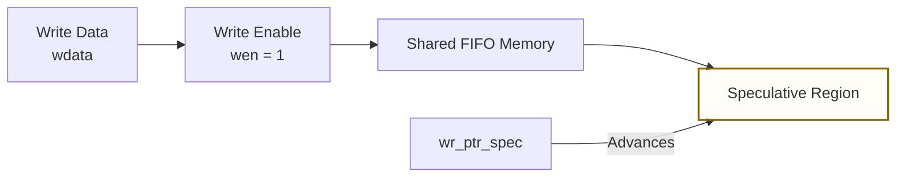
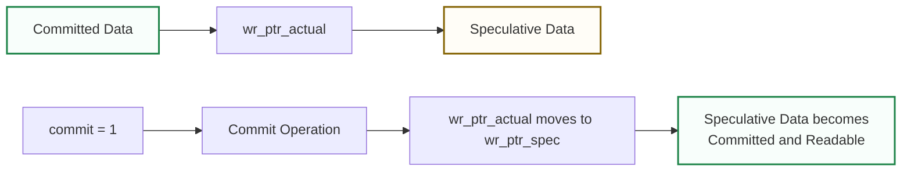
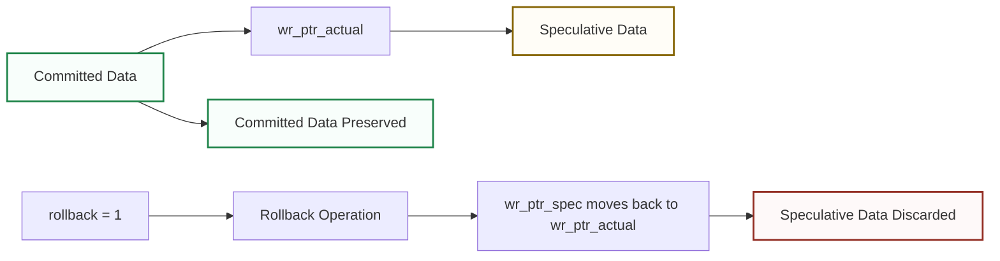

# Transactional Synchronous FIFO

## 1. Project Overview

This project implements a **parameterized Transactional Synchronous FIFO** in Verilog HDL. The design extends the functionality of a conventional synchronous FIFO by introducing a transactional write mechanism based on **speculative writes**, **commit**, and **rollback** operations.

In a conventional FIFO, written data becomes immediately available for reading. In this design, new data is initially stored as **speculative data** and remains invisible to the read interface until a `commit` operation occurs.

The transactional mechanism allows a group of writes to be either:

- **Committed**, making all staged data available for reading.
- **Rolled back**, discarding all uncommitted data.
- **Preserved**, allowing previously committed data to remain unaffected by speculative transaction operations.

The design uses a single shared memory array and three pointers to separate the committed and speculative regions of the FIFO.

---

## 2. Objectives

The main objectives of this project are:

- Design a synchronous FIFO with transactional write capability.
- Support speculative data storage before data becomes readable.
- Implement `commit` functionality to make speculative data visible.
- Implement `rollback` functionality to discard speculative data.
- Preserve committed data during speculative transaction rollback.
- Support simultaneous read, write, commit, and rollback operations.
- Define deterministic priority rules for conflicting control signals.
- Detect FIFO `empty` and `full` conditions correctly.
- Support parameterized data width and FIFO depth.
- Verify normal operation, corner cases, simultaneous operations, and boundary conditions.
- Measure functional coverage of the implemented verification scenarios.
- Synthesize and implement the design using Xilinx Vivado.

---

## 3. Key Features

| Feature | Description |
|---|---|
| FIFO Type | Synchronous FIFO |
| Data Width | Parameterized |
| FIFO Depth | Parameterized |
| Write Mode | Speculative / Transactional |
| Commit | Makes staged data readable |
| Rollback | Discards staged data |
| Read Access | Committed data only |
| Memory | Single shared FIFO memory |
| Empty Detection | Based on committed data |
| Full Detection | Based on committed + speculative data |
| Reset | Active-low synchronous reset |
| Verification | Self-checking testbench |
| Functional Coverage | 26 / 26 bins hit |
| Main Verification Result | 282 PASS / 0 FAIL |

---

## 4. Transactional Concept

The FIFO separates written data into two logical regions:

1. **Committed Data**
2. **Speculative Data**

Committed data is available to the read interface.

Speculative data occupies FIFO memory but cannot be read until it is committed.

### Write

A write operation stores data in the speculative region.

### Commit

A commit operation moves the boundary between committed and speculative data.

No physical memory copy is required.

### Rollback

Rollback discards the speculative region while preserving all previously committed data.

## 5. Design Configuration

The primary configuration used for verification is:

| Parameter     |                           Value |
| ------------- | ------------------------------: |
| Data Width    |                         32 bits |
| FIFO Depth    |                      16 entries |
| Address Width |                 `$clog2(DEPTH)` |
| Pointer Width |      Address width + 1 wrap bit |
| Clock         | Single synchronous clock domain |
| Reset         |    Active-low synchronous reset |

An additional parameterization test was also performed using:

| Parameter  |            Value |
| ---------- | ---------------: |
| Data Width |           8 bits |
| FIFO Depth |        4 entries |
| Result     | 11 PASS / 0 FAIL |

This confirms that the FIFO implementation operates correctly with different supported parameter values.

## 6. Verification Summary

The main self-checking verification environment tested normal FIFO operation, transactional behavior, simultaneous control operations, FIFO boundary conditions, reset behavior, pointer wraparound, and parameterization.

### Main Verification Result
```text
RESULTS: 282 PASS / 0 FAIL / 282 TOTAL
STATUS : ALL TESTS PASSED
```
### Functional Coverage Result
```text
COVERAGE: 26 / 26 BINS HIT
FUNCTIONAL COVERAGE: 100.000000%
```
The verification suite exercised transaction states, basic operations, simultaneous operations, complex operation combinations, FIFO boundary conditions, reset scenarios, and special cases.

Detailed verification information is provided in:

- [05_verification.md](/docs/05_verification_results.md)

## 7. Tools Used
| Tool                    | Purpose                                   |
| ----------------------- | ----------------------------------------- |
| Verilog HDL             | RTL design                                |
| Xilinx Vivado 2018.2    | Simulation, synthesis, and implementation |
| Vivado Simulator        | Functional verification                   |
| Self-Checking Testbench | Automated pass/fail verification          |

## 8. Documentation Structure

The complete project documentation is organized as follows:
```markdown
docs/
├── 01_project_overview.md
├── 02_architecture.md
├── 03_transactional_operations.md
├── 04_design_and_rtl.md
├── 05_verification.md
├── 06_synthesis_implementation.md
├── 07_waveform_analysis.md
└── 08_desssign_decisionss.md
```
Each document describes a specific part of the design, implementation, verification, or final analysis.
