# Transactional FIFO Architecture

## 1. Architecture Overview

The Transactional Synchronous FIFO uses a single shared memory array and three pointers to distinguish between:

- Data that has already been committed and can be read.
- Data that has been written speculatively but is not yet visible to the reader.
- Memory locations that are free for future writes.

The three pointers are:

| Pointer | Purpose |
|---|---|
| `rd_ptr` | Points to the next committed entry to be read |
| `wr_ptr_actual` | Defines the end of the committed region |
| `wr_ptr_spec` | Defines the end of the speculative region |

The following architecture shows the relationship between the write interface, transactional control logic, shared memory, and read interface.

## 2. Top-Level Block Diagram


## 3. Shared Memory Organization

All committed and speculative entries are stored in the same memory array.
```v
reg [WIDTH-1:0] mem [0:DEPTH-1];
```
The distinction between committed and speculative data is not implemented by using separate memory blocks. Instead, the FIFO uses pointer boundaries.

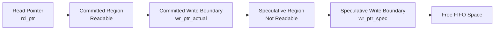

## 4. Pointer Architecture

The FIFO pointers contain one additional wrap bit.

```
Pointer Width = $clog2(DEPTH) + 1
```

The lower bits select the memory address, while the additional bit distinguishes pointer

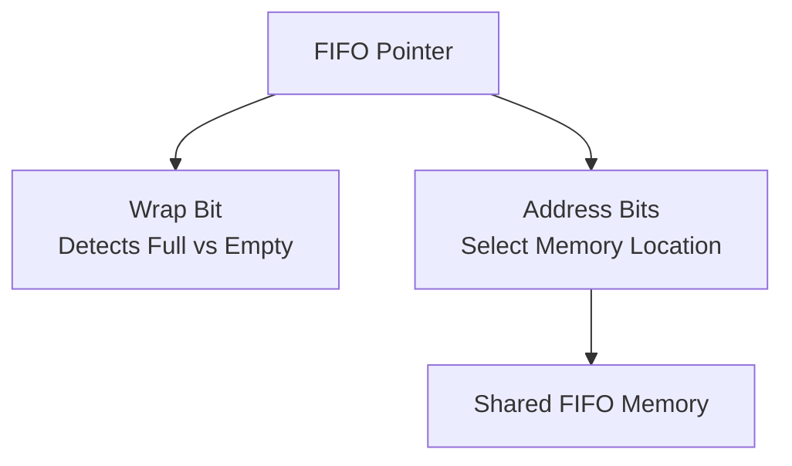
For the default configuration:
| Parameter     |  Value |
| ------------- | -----: |
| `DEPTH`       |     16 |
| `ADDR_W`      |      4 |
| Pointer Width | 5 bits |

The four lower bits select one of the 16 memory locations, while the fifth bit acts as the wrap indicator.

## 5. Read Pointer — `rd_ptr`

The read pointer identifies the oldest committed FIFO entry.

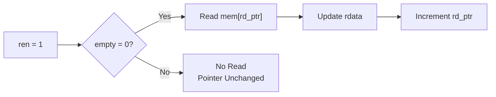
Only committed data can be read.

The rd_ptr never advances into the speculative region.

## 6. Committed Write Pointer — `wr_ptr_actual`

The committed write pointer defines the boundary between readable and speculative data.
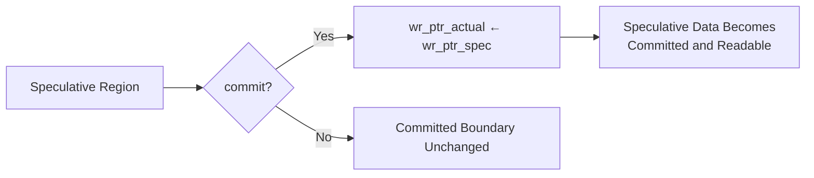
When `commit` is asserted, the committed boundary moves to the current speculative boundary.

No memory data is copied.

## 7. Speculative Write Pointer — `wr_ptr_spec`

The speculative write pointer tracks all occupied FIFO entries, including both committed and speculative data.

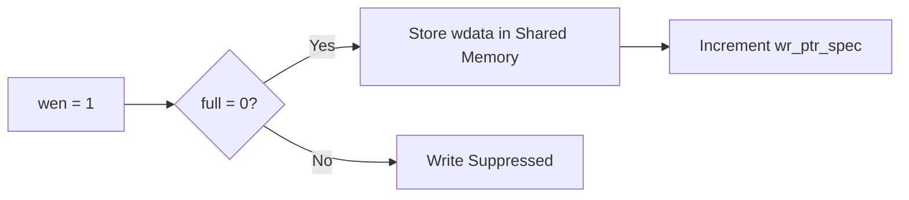
When a write is accepted:
```v
mem[wr_ptr_spec] <= wdata
wr_ptr_spec      <= wr_ptr_spec + 1
```

## 8. Commit Boundary Movement

The following diagram illustrates how commit changes data visibility.

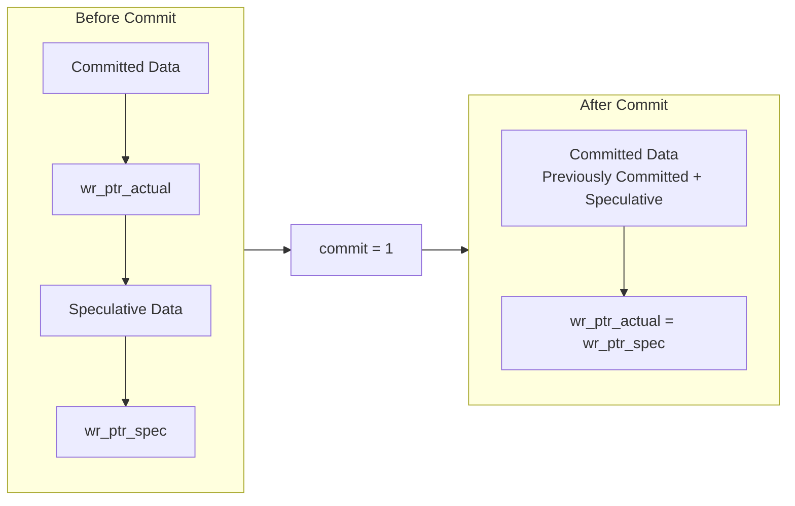

After commit:
```v
wr_ptr_actual <= wr_ptr_spec
```
The speculative data becomes visible to the read interface.

## 9. Rollback Boundary Movement

Rollback discards all currently staged data by moving the speculative boundary back to the committed boundary.

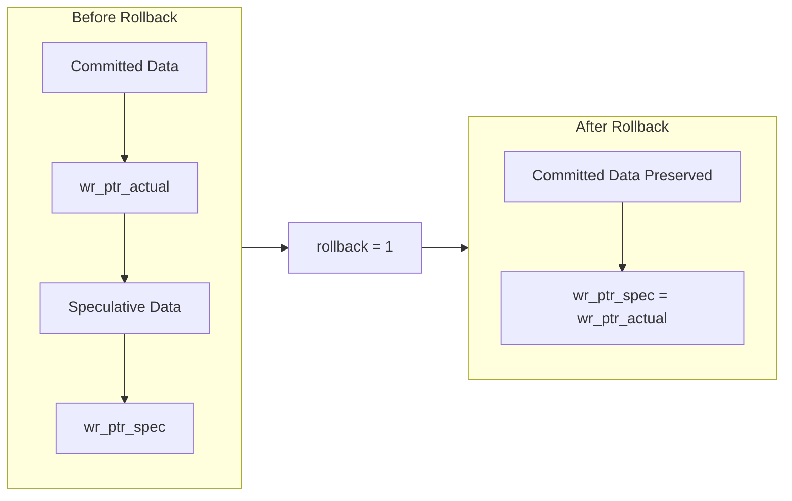

The operation is implemented as:
```
wr_ptr_spec <= wr_ptr_actual
```
The memory contents do not need to be erased. The discarded data simply becomes inaccessible and can be overwritten by future writes.

## 10. FIFO Regions

At any point in time, the FIFO can be logically divided into three regions.
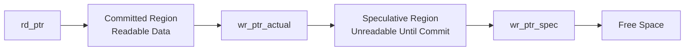
### Committed Region

The committed region exists between:
```
rd_ptr → wr_ptr_actual
```
This data is available for reading.

### Speculative Region

The speculative region exists between:
```
wr_ptr_actual → wr_ptr_spec
```
This data occupies FIFO memory but cannot be read until committed.

### Free Region

The remaining memory between `wr_ptr_spec` and `rd_ptr` is available for new writes.

## 11. Status Flag Generation

### Empty Condition

The FIFO is empty when no committed data is available.
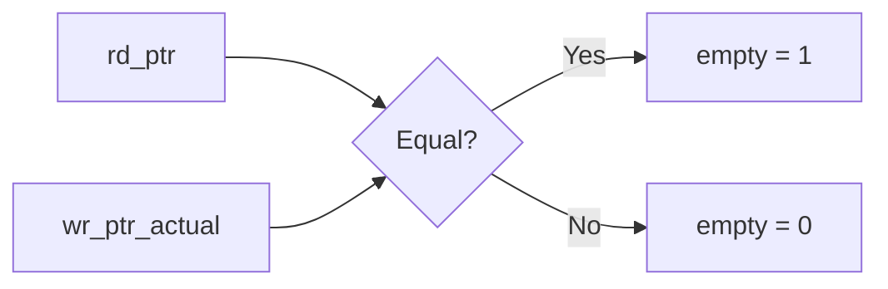
RTL:
```v
assign empty = (rd_ptr == wr_ptr_actual);
```
Speculative data does not affect the empty flag because it is not readable.

## Full Condition

The FIFO is full when all memory locations are occupied by committed and/or speculative data.

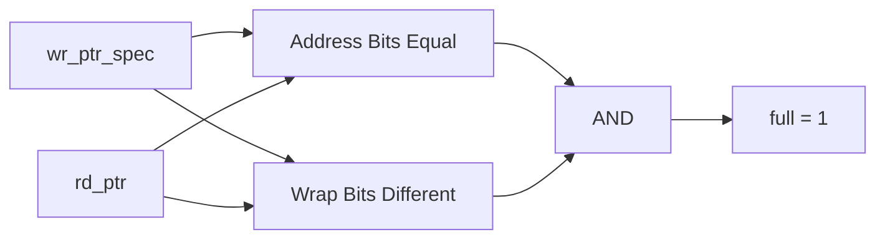
RTL:
```v
assign full =
    (wr_ptr_spec[ADDR_W-1:0] == rd_ptr[ADDR_W-1:0]) &&
    (wr_ptr_spec[ADDR_W] != rd_ptr[ADDR_W]);
```
The full condition includes speculative entries because they already occupy physical FIFO memory.

## 12. Transaction Pending Status

A transaction is pending whenever speculative data exists.
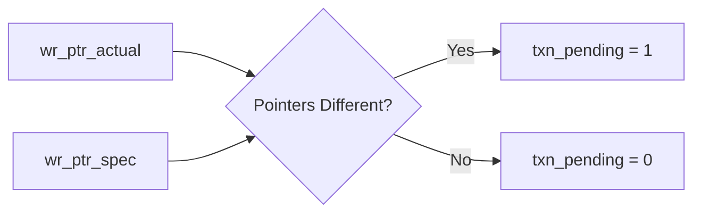

## 13. Occupancy Counters

The FIFO provides three counters.
| Counter             | Definition                    | Description                 |
| ------------------- | ----------------------------- | --------------------------- |
| `committed_count`   | `wr_ptr_actual - rd_ptr`      | Number of readable entries  |
| `speculative_count` | `wr_ptr_spec - wr_ptr_actual` | Number of staged entries    |
| `total_count`       | `wr_ptr_spec - rd_ptr`        | Total occupied FIFO entries |

These counters provide visibility into the internal transactional state of the FIFO.

## 14. Architecture Summary

The Transactional FIFO achieves commit and rollback functionality without additional memory or data-copy operations.

The design relies on three pointer boundaries:
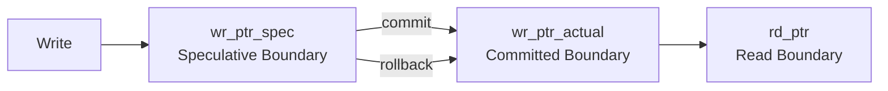
This pointer-based architecture provides:

- Efficient speculative writes.
- Constant-time commit.
- Constant-time rollback.
- Preservation of previously committed data.
- No memory copying during transaction resolution.
- Clear separation between readable and speculative FIFO regions.