# Transaction Operations

This document explains how the Transactional FIFO handles speculative writes and how data is either made permanently readable using **commit** or discarded using **rollback**.

The FIFO uses a single shared memory array and three pointers:

- **`rd_ptr`** — points to the next committed data item to be read.
- **`wr_ptr_actual`** — marks the boundary of committed data.
- **`wr_ptr_spec`** — marks the end of speculative data.

Speculative data occupies FIFO memory immediately, but it cannot be read until a commit operation moves the committed boundary forward.

---

## 1. Transactional FIFO Data Flow

The overall transactional behavior is shown below.

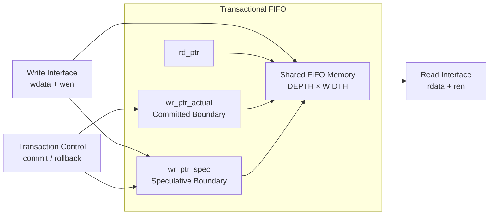

The write interface stores incoming data in the shared FIFO memory. The data initially belongs to the **speculative region**.

The `wr_ptr_spec` pointer advances whenever a valid write is accepted. The `wr_ptr_actual` pointer advances only when a commit operation occurs.

---

# 2. Write Operation

A write operation places new data into the speculative region of the FIFO.

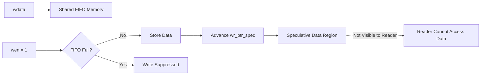

### Operation

When:

```v
wen = 1
full = 0
```

the FIFO performs:

```v
mem[wr_ptr_spec] <= wdata
wr_ptr_spec      <= wr_ptr_spec + 1
```

The data is stored physically in the FIFO memory, but it remains speculative.

The read side still uses `wr_ptr_actual` as its visibility boundary.

Therefore:

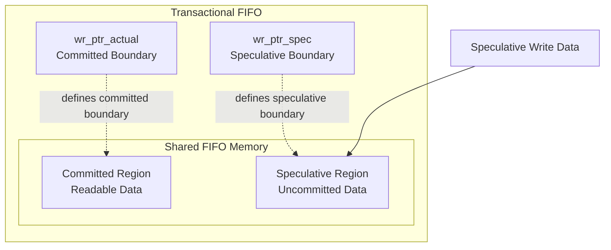

Only the committed portion is visible to the reader.

---

# 3. Commit Operation

A commit operation makes all currently staged speculative data available for reading.

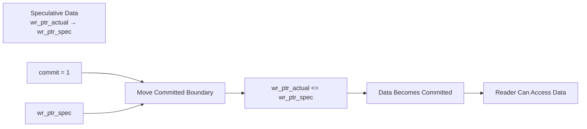

### Operation

When:

```v
commit = 1
rollback = 0
```

the FIFO performs:

```v
wr_ptr_actual <= wr_ptr_spec
```

The speculative pointer itself does not move during a commit unless a write operation is also occurring.

After commit:

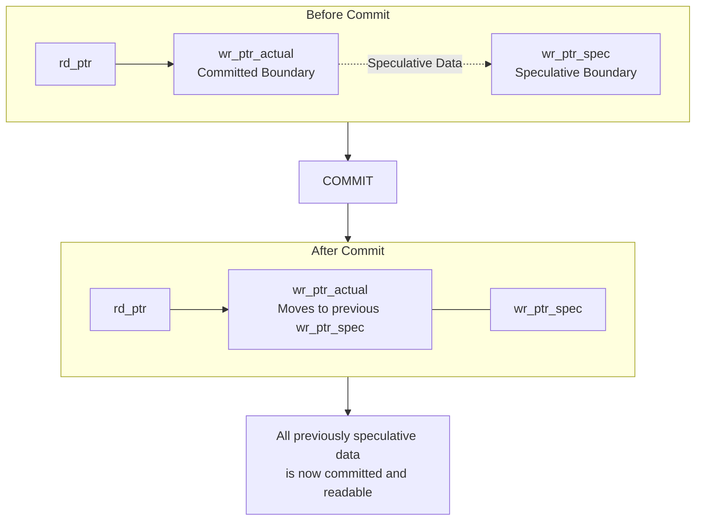

All data between the old `wr_ptr_actual` and `wr_ptr_spec` becomes readable.

---

# 4. Rollback Operation

A rollback operation discards all speculative data while preserving previously committed data.

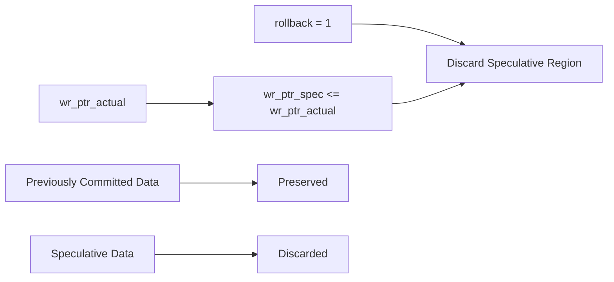

### Operation

When:

```v
rollback = 1
```

the FIFO performs:

```v
wr_ptr_spec <= wr_ptr_actual
```

The committed pointer does not move.

Therefore, the speculative region is logically discarded without requiring the memory contents to be physically erased.

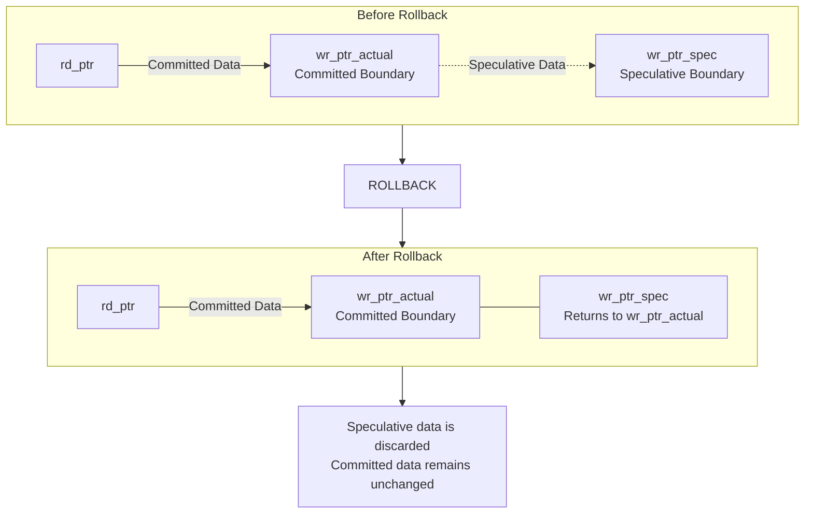

The old memory values may still physically exist in the array, but they are no longer part of the FIFO because the speculative pointer has been moved back.

---

# 5. Complete Transaction Lifecycle

The complete lifecycle of a transaction is shown below.

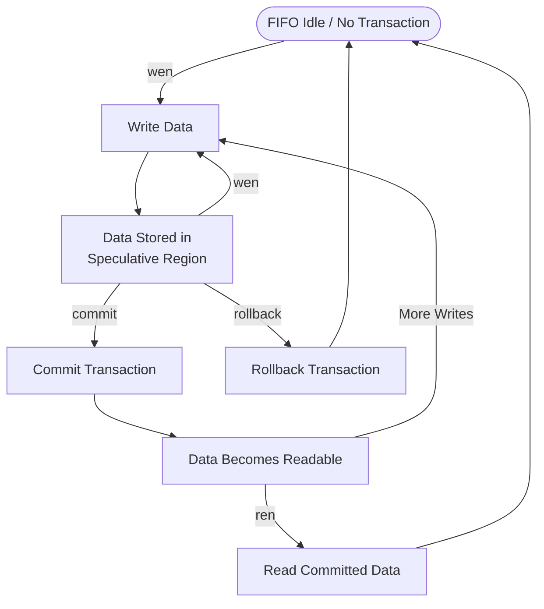

The two possible transaction outcomes are:

| Operation | Result |
|---|---|
| `wen` | Data enters the speculative region |
| `commit` | All currently speculative data becomes committed |
| `rollback` | All speculative data is discarded |
| `ren` | Reads only committed data |

---

# 6. Pointer Movement

The following table summarizes how each operation affects the FIFO pointers.

| Operation | `rd_ptr` | `wr_ptr_actual` | `wr_ptr_spec` |
|---|---|---|---|
| Reset | Reset to 0 | Reset to 0 | Reset to 0 |
| Write | No change | No change | Increment |
| Commit | No change | Move to `wr_ptr_spec` | No change |
| Rollback | No change | No change | Move to `wr_ptr_actual` |
| Read | Increment | No change | No change |

---

# 7. Simultaneous Operation Priority

The Transactional FIFO supports multiple control signals during the same clock cycle.

The implemented priority is:

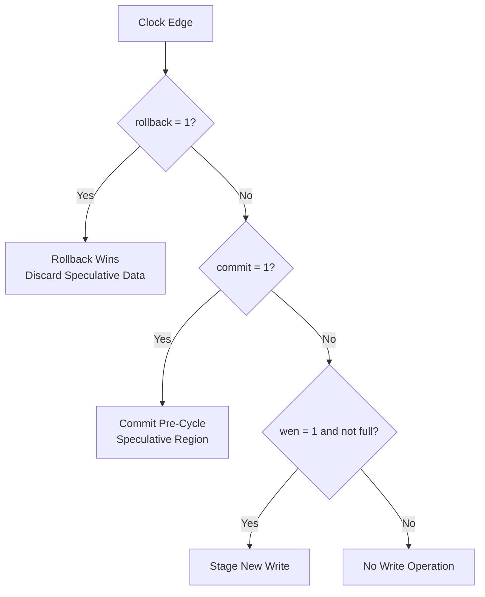

The important conflict rules are:

### Commit + Rollback

```v
commit = 1
rollback = 1
```

**Rollback has priority.**

The speculative region is discarded.

---

### Write + Commit

```v
wen    = 1
commit = 1
```

The commit uses the **pre-cycle value** of `wr_ptr_spec`.

Therefore:

- Previously staged data becomes committed.
- The new write remains speculative.
- A later commit is required to make the new write readable.

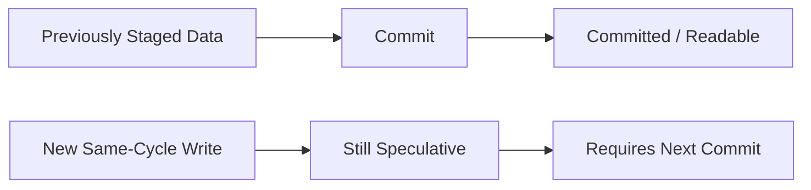

---

### Write + Rollback

```v
wen      = 1
rollback = 1
```

Rollback has priority.

Any speculative data, including the same-cycle write, is discarded.

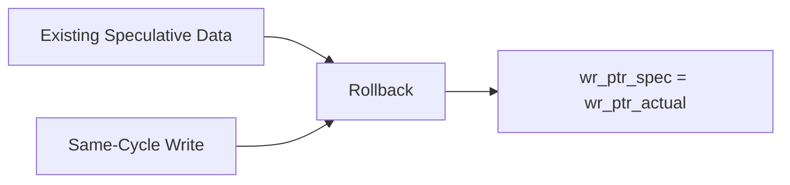

---

# 8. Data Visibility

The most important feature of the Transactional FIFO is that **data visibility is controlled by the committed write pointer**.

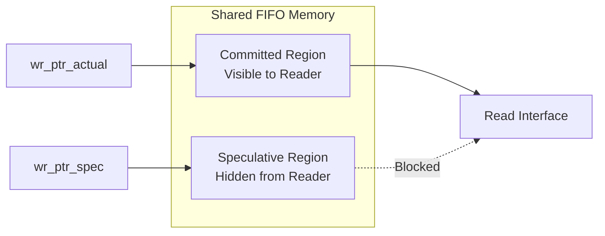

The `empty` flag is also based only on committed data:

```verilog
assign empty = (rd_ptr == wr_ptr_actual);
```

Therefore, a FIFO containing only speculative data can still report:

```verilog
empty = 1
txn_pending = 1
```

This ensures that uncommitted data can never be read accidentally.

---

# 9. FIFO Full Condition

The FIFO full condition includes both committed and speculative data.

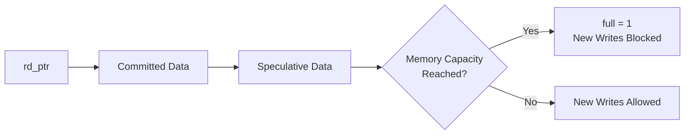

The full flag is derived from `wr_ptr_spec`, because speculative entries already occupy physical memory locations.

```verilog
assign full =
    (wr_ptr_spec[ADDR_W-1:0] == rd_ptr[ADDR_W-1:0]) &&
    (wr_ptr_spec[ADDR_W] != rd_ptr[ADDR_W]);
```

Thus, speculative writes cannot overwrite committed or unread data.

---

# 10. Summary

The Transactional FIFO extends a conventional synchronous FIFO by separating:

- **Physical data storage**
- **Committed data visibility**
- **Speculative transaction state**

The three-pointer architecture enables this behavior:

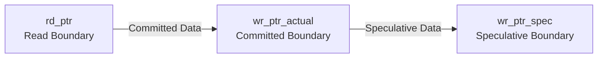

This architecture provides transactional behavior without requiring a separate staging memory.

A write immediately consumes FIFO storage, but the data becomes visible only after `commit`. A `rollback` simply restores the speculative boundary to the committed boundary, discarding all uncommitted entries while preserving committed data.