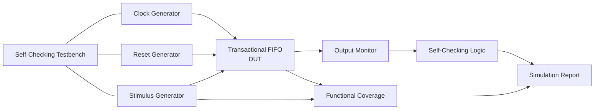
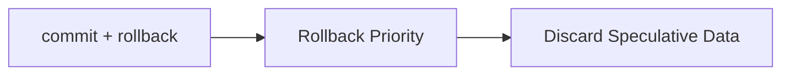

# Transactional FIFO Test Plan

## 1. Purpose

This document describes the verification plan for the Transactional
Synchronous FIFO.

The objective is to verify correct FIFO behavior together with the
transactional features introduced by speculative writes, commit, and
rollback operations.

The verification environment uses a self-checking Verilog testbench that
automatically compares expected and observed results.

---

## 2. Verification Objectives

The Transactional FIFO verification focuses on the following areas:

- Normal FIFO write and read operation
- Speculative write behavior
- Commit operation
- Rollback operation
- Preservation of committed data
- Simultaneous operations
- FIFO empty and full boundary conditions
- Pointer wraparound
- Reset behavior
- Parameterization
- Transaction conflict priority
- Functional coverage

The main requirement is that speculative data must never become readable
until a valid `commit` operation occurs.

---

## 3. Testbench Architecture

The verification environment consists of:


The testbench applies stimulus to the DUT and checks:

- `rdata`
- `empty`
- `full`
- `txn_pending`
- `committed_count`
- `speculative_count`
- `total_count`

Each check reports either:
```
[PASS]
```
or
```
[FAIL]
```
The final simulation report summarizes the total number of passed and
failed checks.

## 4. Test Categories
### 4.1 Basic FIFO Operation

`Test 01 — Normal Write → Commit → Read`


Objective:
Verify that written data remains speculative until committed.

Sequence:

1. Write data into the FIFO.
2. Verify that the FIFO remains empty.
3. Verify txn_pending = 1.
4. Assert commit.
5. Verify that the data becomes readable.
6. Read the data.
7. Verify FIFO returns to the empty state.

`Test 02 — Write → Rollback`

Objective:
Verify that rollback discards speculative data.

Sequence:

Expected behavior:

- No data becomes readable.
- `txn_pending` returns to `0`.
- `speculative_count` returns to `0`.
- FIFO remains empty.

`Test 03 — Committed Data Survives Rollback`

Objective:
Verify that rollback only affects speculative data.

Sequence:

1. Write and commit old data.
2. Write new speculative data.
3. Assert rollback.
4. Read the FIFO.

Expected result:
```
Committed data → Preserved
Speculative data → Discarded
```
## 5. Simultaneous Operation Tests
### 5.1 Read + Write

`Test 04 — Simultaneous Read and Write`

Verify simultaneous FIFO read and speculative write behavior.

The previously committed data must be read correctly while the new write
enters the speculative region.

### 5.2 Continuous Write Throughput

`Test 05 — One Write Per Clock`

Verify that the FIFO accepts one speculative write per clock cycle until
the FIFO becomes full.

This test checks:

- Write pointer advancement
- Memory addressing
- Consecutive data storage
- FIFO ordering

### 5.3 Full FIFO Due to Speculative Data

`Test 06 — Speculative Full Condition`

Fill the entire FIFO using speculative writes without committing.

Expected:
```
committed_count   = 0
speculative_count = DEPTH
total_count       = DEPTH
full              = 1
```
Additional writes must be suppressed.

## 6. Pointer Verification
### 6.1 Pointer Wraparound

`Test 07 — Depth Boundary Wraparound`

Verify correct pointer behavior when the FIFO crosses the memory depth
boundary.

The test performs:

1. Fill FIFO.
2. Commit data.
3. Read entries.
4. Perform additional writes after pointer wraparound.
5. Commit and read remaining entries.

This verifies that the additional pointer wrap bit correctly distinguishes
between full and empty states.

## 7. Reset Verification

`Test 08 — Reset During Active Transaction`

Reset is asserted while speculative data exists.

Expected after reset:
```
rd_ptr            = 0
wr_ptr_actual     = 0
wr_ptr_spec       = 0

empty             = 1
full              = 0
txn_pending       = 0

committed_count   = 0
speculative_count = 0
total_count       = 0
```
`Test 25 — Reset During Simultaneous Operations`

Verify reset behavior when multiple transaction-related operations are
active.

The reset must restore the FIFO to its initial empty state regardless of
the current transaction state.

## 8. No-Operation Transaction Tests

`Test 09 — Commit with No Pending Transaction`

Assert `commit` when:
```v
wr_ptr_actual == wr_ptr_spec
```
Expected behavior:

- No pointer corruption
- FIFO state unchanged
- Operation behaves as a safe no-op

`Test 10 — Rollback with No Pending Transaction`

Assert `rollback` when no speculative data exists.

Previously commit  ted data must remain intact and readable.

## 9. Transaction Conflict Tests

`Test 11 — Commit + Rollback`

Both `commit` and `rollback` are asserted simultaneously.

The defined priority is:

Expected:
```
rollback wins
```
All speculative data is discarded.

`Test 12 — Write + Commit`

Verify that `commit` uses the pre-cycle value of `wr_ptr_spec`.

The write occurring in the same clock cycle must remain speculative.

Expected sequence:
```
Existing Speculative Data → Committed
Same-Cycle New Write      → Still Speculative
```
A second commit makes the new write readable.

`Test 13 — Write + Rollback`

Verify rollback priority when wen and rollback occur simultaneously.

Expected:
```
Same-cycle write → Discarded
Existing speculative data → Discarded
```
`Test 14 — Read + Commit`

Verify simultaneous reading of committed data and committing of
speculative data.

The read must return the oldest committed entry while the speculative
region becomes committed.

`Test 15 — Read + Rollback`

Verify simultaneous read and rollback.

Expected:
```
The committed entry is read correctly.
Speculative data is discarded.
```
## 10. Full Boundary Tests

`Test 16 — Read + Write at Full Boundary`

Verify simultaneous read and write when the FIFO is full.

The read releases one committed location.

The test verifies the resulting FIFO status and occupancy counters.

`Test 17 — Write + Commit Near Full Boundary`

Verify simultaneous write and commit when the FIFO contains
`DEPTH - 1` speculative entries.

The final write fills the remaining location while the previous
speculative region is committed.

`Test 19 — Write + Rollback While Full`

Verify rollback behavior when all FIFO storage is occupied by speculative
data.

Expected:
```
Before rollback:
    full = 1

After rollback:
    empty = 1
    full = 0
    speculative_count = 0
```
## 11. Complex Simultaneous Operations

`Test 20 — Read + Write + Commit`

Verify simultaneous:

- Read
- Speculative write
- Commit

The expected behavior follows the defined priority and pre-cycle pointer
semantics.

The existing speculative data is committed while the new same-cycle write
remains speculative.

`Test 22 — Read + Write + Commit at Full Boundary`

Verify combined operations when the FIFO is full.

The test checks:

- Correct oldest-data read
- Correct commit behavior
- Full flag update
- Correct remaining FIFO ordering

`Test 23 — Read + Write + Rollback at Full Boundary`

Verify rollback priority during simultaneous read and write operations.

The speculative region is discarded while committed data remains available.

`Test 24 — Read + Write + Commit + Rollback`

This test verifies the highest-complexity transaction conflict.

Because rollback has priority:
```
rollback > commit
rollback > same-cycle speculative write
```
Expected result:

- Read operation completes for valid committed data.
- Commit is suppressed.
- Speculative data is discarded.
- Same-cycle speculative write is discarded.

## 12. Parameterization Test

`Test 26 — WIDTH = 8, DEPTH = 4`

A separate parameterized test verifies that the FIFO is not dependent on
the default configuration.

Configuration:
```v
WIDTH = 8
DEPTH = 4
```
The test performs:

1. Fill all four FIFO locations.
2. Verify full.
3. Commit all entries.
4. Read all entries.
5. Verify FIFO ordering.
6. Verify empty.

This validates:

- Parameterized data width
- Parameterized memory depth
- Pointer width calculation
- Full and empty detection

## 13. Functional Coverage

Functional coverage is implemented in the self-checking testbench.

The coverage model tracks the following categories.

### 1. Transaction States
| Coverage Bin        | Description                  |
| ------------------- | ---------------------------- |
| 01 No Transaction      | No speculative data pending  |
| 02 Transaction Pending | Speculative data exists      |
| 03 Commit              | Commit operation exercised   |
| 04 Rollback            | Rollback operation exercised |

### 2. Basic Operations
| Coverage Bin | Description         |
| ------------ | ------------------- |
| 05 Write        | Speculative write   |
| 06 Read         | Committed data read |

### 3. Simultaneous Operations
| Coverage Bin      |
| ----------------- |
| 07 Read + Write      |
| 08 Write + Commit    |
| 09 Write + Rollback  |
| 10 Read + Commit     |
| 11 Read + Rollback   |
| 12 Commit + Rollback |

### 4. Complex Operations

| Coverage Bin                     |
| -------------------------------- |
| 13 Read + Write + Commit            |
| 14 Read + Write + Rollback          |
| 15 Write + Commit + Rollback        |
| 16 Read + Write + Commit + Rollback |

### 5. FIFO Boundary Conditions
| Coverage Bin  |
| ------------- |
| 17 Empty         |
| 18 Near Full     |
| 19 Full          |
| 20 Read at Full  |
| 21 Write at Full |

### 6. Reset Coverage
| Coverage Bin             |
| ------------------------ |
| 22 Reset while Idle         |
| 23 Reset during Transaction |

### 7. Special Cases
| Coverage Bin                 |
| ---------------------------- |
| 24 Commit with no Transaction   |
| 25 Rollback with no Transaction |
| 26 Pointer Wraparound           |

## 14. Coverage Results

The completed verification suite achieved:
```
TOTAL FUNCTIONAL COVERAGE

Coverage Bins Hit : 26 / 26
Functional Coverage : 100%
```
All defined functional coverage bins were exercised successfully.

## 15. Verification Results

The main self-checking verification suite completed with:
```
TOTAL CHECKS : 282
PASS         : 282
FAIL         : 0

STATUS : ALL TESTS PASSED
```
The parameterization test also completed successfully:
```
WIDTH = 8
DEPTH = 4

RESULTS : 11 PASS / 0 FAIL
STATUS  : ALL PARAMETER TESTS PASSED
```

## 16. Verification Summary

The verification plan confirms correct operation of the Transactional
Synchronous FIFO across normal, boundary, transactional, reset, and
simultaneous-operation scenarios.

The completed verification demonstrates:

- Correct FIFO ordering
- Correct speculative write behavior
- Correct commit operation
- Correct rollback operation
- Protection of committed data
- Correct transaction conflict priority
- Correct pointer wraparound
- Correct empty and full detection
- Correct reset behavior
- Successful parameterization
- 282 / 282 self-checking tests passed
- 26 / 26 functional coverage bins hit
- 100% functional coverage

---