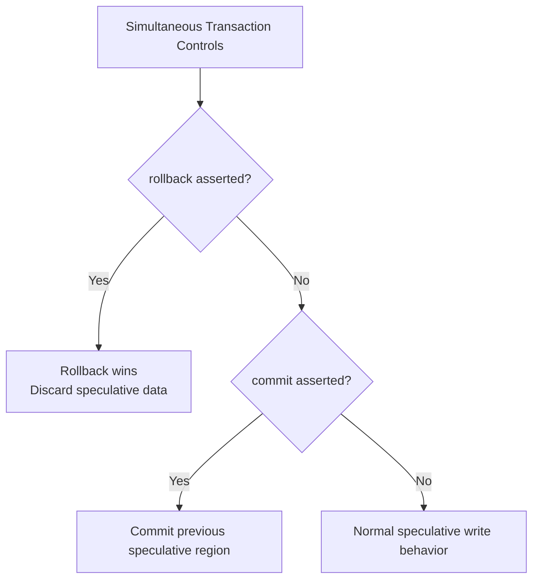

# Verification Results

## 1. Overview

The Transactional Synchronous FIFO was verified using a self-checking
Verilog testbench.

The verification environment exercised normal FIFO operation, speculative
writes, commit and rollback behavior, simultaneous operations, FIFO
boundary conditions, reset behavior, pointer wraparound, and parameterized
configurations.

The default DUT configuration was:

| Parameter | Value |
|---|---:|
| `WIDTH` | 32 |
| `DEPTH` | 16 |
| Address Width | 4 bits |
| Pointer Width | 5 bits |

The verification was performed using Vivado Simulator.

---

## 2. Main Verification Results

The complete self-checking verification suite produced:

```text
=====================================================
 RESULTS: 282 PASS / 0 FAIL / 282 TOTAL
 STATUS : ALL TESTS PASSED
=====================================================
```

### Result Summary
| Metric       | Result |
| ------------ | -----: |
| Total Checks |    282 |
| Passed       |    282 |
| Failed       |      0 |
| Pass Rate    |   100% |

All expected outputs, status flags, transaction states, and occupancy
counters matched the reference expectations.

## 3. Functional Coverage Results

Functional coverage was implemented in the testbench to confirm that all
planned functional scenarios were exercised.

The coverage report produced:
```
=====================================================
 FUNCTIONAL COVERAGE REPORT
=====================================================

 Transaction States:
   No Transaction                 : 1
   Transaction Pending            : 1
   Commit                         : 1
   Rollback                       : 1

 Basic Operations:
   Write                          : 1
   Read                           : 1

 Simultaneous Operations:
   Read + Write                   : 1
   Write + Commit                 : 1
   Write + Rollback               : 1
   Read + Commit                  : 1
   Read + Rollback                : 1
   Commit + Rollback              : 1

 Complex Operations:
   Read + Write + Commit          : 1
   Read + Write + Rollback        : 1
   Write + Commit + Rollback      : 1
   Read + Write + Commit + Rollback : 1

 FIFO Boundary Conditions:
   Empty                          : 1
   Near Full                      : 1
   Full                           : 1
   Read at Full                   : 1
   Write at Full                  : 1

 Reset Coverage:
   Reset while Idle               : 1
   Reset during Transaction       : 1

 Special Cases:
   Commit with no Transaction     : 1
   Rollback with no Transaction   : 1
   Pointer Wraparound             : 1

-----------------------------------------------------
 COVERAGE: 26 / 26 BINS HIT
 FUNCTIONAL COVERAGE: 100.000000%
=====================================================
```
### Coverage Summary
| Coverage Category        |        Bins |
| ------------------------ | ----------: |
| Transaction States       |       4 / 4 |
| Basic Operations         |       2 / 2 |
| Simultaneous Operations  |       6 / 6 |
| Complex Operations       |       4 / 4 |
| FIFO Boundary Conditions |       5 / 5 |
| Reset Coverage           |       2 / 2 |
| Special Cases            |       3 / 3 |
| **Total**                | **26 / 26** |

Final Functional Coverage
Functional Coverage: 100%
Coverage Bins Hit : 26 / 26

All defined functional coverage bins were successfully exercised.

## 4. Transaction Operation Results

### 4.1 Write → Commit → Read

The FIFO correctly stored incoming data as speculative data.

Before commit:

- `empty = 1`
- `txn_pending = 1`
- `committed_count = 0`
- `speculative_count = 1`

After commit:

- `empty = 0`
- `txn_pending = 0`
- `committed_count = 1`
- `speculative_count = 0`

The committed data was read back successfully.

#### Result
```
PASS
```
### 4.2 Write → Rollback

Speculative data was correctly discarded after rollback.

After rollback:
```
empty             = 1
txn_pending       = 0
committed_count   = 0
speculative_count = 0
total_count       = 0
```
#### Result
```
PASS
```

### 4.3 Committed Data Preservation

Previously committed data remained intact when later speculative data was
rolled back.

#### Result
```
Committed data    : Preserved
Speculative data  : Discarded
```
```
PASS
```

## 5. Simultaneous Operation Results

The design was tested under multiple simultaneous control combinations.
| Operation                        | Result |
| -------------------------------- | ------ |
| Read + Write                     | PASS   |
| Write + Commit                   | PASS   |
| Write + Rollback                 | PASS   |
| Read + Commit                    | PASS   |
| Read + Rollback                  | PASS   |
| Commit + Rollback                | PASS   |
| Read + Write + Commit            | PASS   |
| Read + Write + Rollback          | PASS   |
| Write + Commit + Rollback        | PASS   |
| Read + Write + Commit + Rollback | PASS   |

The tests confirmed the intended transaction priority rules.


The observed behavior matched the documented design rules.

## 6. FIFO Boundary Results

The FIFO was tested at empty, near-full, and full boundaries.

### Empty Condition

The FIFO correctly asserted:
```v
empty = 1
```
when:
```v
rd_ptr == wr_ptr_actual
```
Speculative data alone did not make the FIFO readable.

#### Result
```
PASS
```

### Full Condition

The FIFO correctly accounted for both committed and speculative entries.

The full condition was asserted when:
```v
total_count = DEPTH
```
For the default configuration:
```v
DEPTH = 16
```
The verification confirmed:
```
committed_count   = 0
speculative_count = 16
total_count       = 16
full              = 1
```
Additional writes were correctly suppressed.

#### Result
```
PASS
```

## 7. Full Boundary Simultaneous Operations

The following boundary scenarios were verified:
| Test                                     | Result |
| ---------------------------------------- | ------ |
| Read + Write at Full Boundary            | PASS   |
| Write + Commit Near Full Boundary        | PASS   |
| Write + Rollback While Full              | PASS   |
| Read + Write + Commit at Full Boundary   | PASS   |
| Read + Write + Rollback at Full Boundary | PASS   |

These tests verified correct interaction between:

- `full`
- `empty`
- `committed_count`
- `speculative_count`
- `total_count`
- Transaction control signals

No pointer corruption or incorrect occupancy values were observed.

## 8. Pointer Wraparound Results

The FIFO was filled to its configured depth and drained across the memory
boundary.

The test verified correct operation before and after pointer wraparound.

All expected data values were read back in FIFO order.

Final state:
```
empty = 1
total_count = 0
```
#### Result
```
PASS
```
The additional pointer wrap bit successfully distinguished full and empty
conditions when the address portions of the pointers were equal.

## 9. Reset Results

Reset behavior was verified in multiple operating states.

### Reset While Idle

The FIFO returned to:
```
empty             = 1
full              = 0
txn_pending       = 0
committed_count   = 0
speculative_count = 0
total_count       = 0
```
#### Result
```
PASS
```
### Reset During Active Transaction

Reset was asserted while speculative data was pending.

All speculative and committed state was cleared.

#### Result
```
PASS
```
### Reset During Simultaneous Operations

Reset was also tested while multiple FIFO operations were active.

The FIFO returned to the initial empty state without retaining transaction
state.

#### Result
```
PASS
```
## 10. Special Transaction Cases

### Commit Without Pending Transaction

A commit with no speculative data behaved as a safe no-op.

#### Result
```
PASS
```
### Rollback Without Pending Transaction

A rollback with no speculative data did not affect previously committed
data.

#### Result
```
PASS
```

### Commit + Rollback Conflict

When both control signals were asserted simultaneously:
```
rollback > commit
```
Rollback correctly took priority and speculative data was discarded.

#### Result
```
PASS
```

## 11. Parameterization Results

A separate testbench was used to verify operation with a different FIFO
configuration.

### Test Configuration
```
WIDTH = 8
DEPTH = 4
```
The parameterization test performed:

1. Fill all four FIFO locations.
2. Verify the full condition.
3. Commit all entries.
4. Read all entries.
5. Verify FIFO ordering.
6. Verify the empty condition.

Simulation output:
```
=====================================================
 Transactional FIFO - Parameterization Test
 WIDTH = 8, DEPTH = 4
=====================================================

 RESULTS: 11 PASS / 0 FAIL / 11 TOTAL
 STATUS : ALL PARAMETER TESTS PASSED
=====================================================
```
### Parameterization Summary
| Metric       | Result |
| ------------ | -----: |
| Total Checks |     11 |
| Passed       |     11 |
| Failed       |      0 |
| Pass Rate    |   100% |
This confirms that the design operates correctly beyond the default
`WIDTH = 32` and `DEPTH = 16` configuration.

## 12. Waveform Verification

Simulation waveforms were inspected to visually verify the relationship
between control signals, data paths, status flags, and occupancy counters.

The primary signals observed were:
```
clk
resetn

wdata
wen
commit
rollback

ren
rdata

empty
full
txn_pending

committed_count
speculative_count
total_count
```
The waveforms confirmed:

- Data is written only when `wen` is asserted and the FIFO is not full.
- New writes enter the speculative region.
- `commit` makes previously speculative data visible.
- Same-cycle write and commit preserve the new write as speculative.
- `rollback` discards speculative data.
- Rollback takes priority over commit.
- `empty` depends only on committed data.
- `full` accounts for both committed and speculative occupancy.
- Occupancy counters track transaction state correctly.
- FIFO ordering is preserved through pointer wraparound.

Add the relevant Vivado waveform screenshots below this section as
the project documentation is finalized.

## 13. Verification Artifacts

The following verification artifacts were generated during simulation:
```
Transactional_FIFO/
│
├── transactional_fifo.v
├── tb_transactional_fifo.v
├── tb_parameterized_fifo.v
│
├── simulation/
│   ├── sim.log
│   └── waveform screenshots
│
└── verification/
    └── verification_report.txt
```
The verification report contains:

- PASS/FAIL results
- Functional coverage report
- Coverage summary
- Final verification status

## 14. Final Verification Summary

The Transactional Synchronous FIFO successfully passed all planned
verification scenarios.

### Main Verification
```
Total Tests Passed : 282 / 282
Failures           : 0
Pass Rate          : 100%
```
### Functional Coverage
```
Coverage Bins Hit  : 26 / 26
Functional Coverage: 100%
```
### Parameterization
```
Configuration      : WIDTH = 8, DEPTH = 4
Tests Passed       : 11 / 11
Failures           : 0
```
## 15. Conclusion

The verification results demonstrate that the Transactional Synchronous
FIFO correctly implements standard synchronous FIFO behavior together with
speculative write transactions.

The design successfully supports:

- Speculative writes
- Commit operations
- Rollback operations
- Isolation of speculative data from the reader
- Preservation of committed data
- Defined simultaneous-operation behavior
- Rollback priority during transaction conflicts
- Full and empty boundary handling
- Pointer wraparound
- Synchronous reset
- Parameterized FIFO width and depth

The complete verification suite achieved:
```
282 / 282 PASS
0 FAILURES
26 / 26 COVERAGE BINS HIT
100% FUNCTIONAL COVERAGE
```
Therefore, the RTL implementation is functionally verified against the
defined test plan.

---