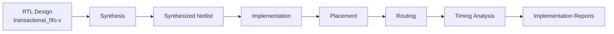
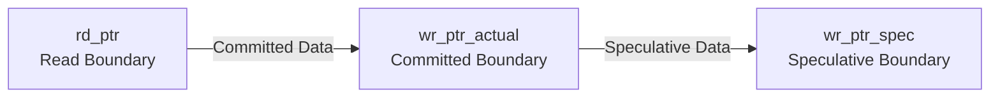
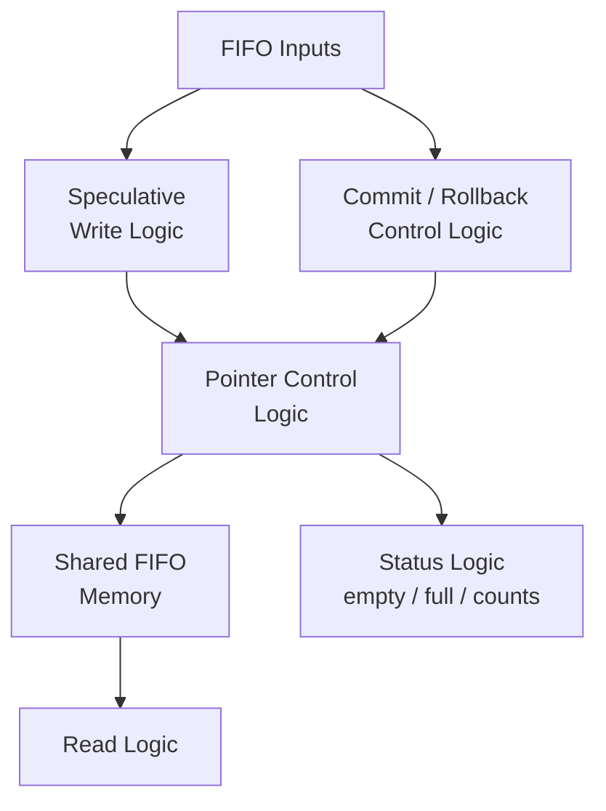
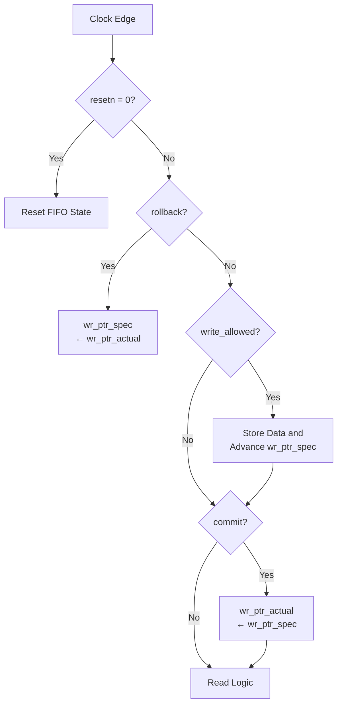
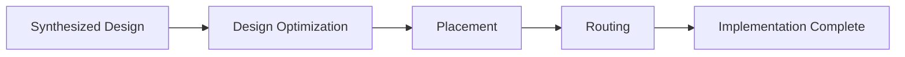
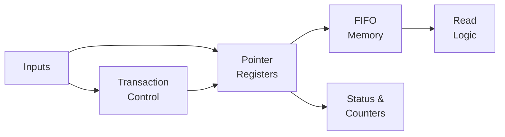
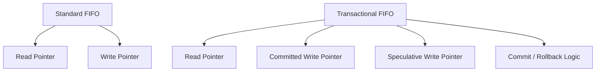

# Synthesis and Implementation

## 1. Overview

This document describes the synthesis and implementation of the
Transactional Synchronous FIFO using Xilinx Vivado.

The RTL design was synthesized and implemented to verify that the
Transactional FIFO can be mapped to FPGA hardware without synthesis or
implementation errors.

The implementation flow includes:


The design was evaluated using the following stages:

- RTL elaboration
- Synthesis
- Resource utilization analysis
- Implementation
- Timing analysis
- Post-implementation schematic inspection

## 2. Design Configuration

The default Transactional FIFO configuration used for synthesis is:
| Parameter     |                  Value |
| ------------- | ---------------------: |
| `WIDTH`       |                     32 |
| `DEPTH`       |                     16 |
| `ADDR_W`      |    `$clog2(DEPTH)` = 4 |
| Pointer Width |                 5 bits |
| Reset Type    | Active-low synchronous |

The FIFO uses three pointers:

These pointers provide the transactional behavior:

`rd_ptr` tracks the next committed entry to read.
`wr_ptr_actual` marks the boundary of committed data.
`wr_ptr_spec` marks the end of speculative data.

## 3. RTL Synthesis

The RTL source was synthesized using Vivado synthesis.

The synthesis process converts the Verilog description into a technology
independent logic representation and then maps the design to the resources
available in the selected FPGA device.

The main RTL module is:
```
transactional_fifo
```
The synthesis process analyzes:

- Sequential logic
- Combinational logic
- Memory array inference
- Pointer arithmetic
- Status flag generation
- Transaction control logic

The primary logic implemented by the design includes:



## 4. Synthesized Design Structure

The synthesized design contains several major functional sections.

### 4.1 Shared FIFO Memory

The FIFO storage is defined as:
```v
reg [WIDTH-1:0] mem [0:DEPTH-1];
```
For the default configuration:
```
Memory Depth = 16
Memory Width = 32 bits
Total Storage = 512 bits
```
Depending on the selected FPGA device and synthesis settings, this small
memory structure may be implemented using FPGA logic resources rather than
a dedicated block RAM.

### 4.2 Pointer Registers

Three pointer registers are synthesized:
```
rd_ptr
wr_ptr_actual
wr_ptr_spec
```
Each pointer contains:
```v
ADDR_W + 1 bits
```
For `DEPTH = 16`:
```v
ADDR_W = 4
Pointer Width = 5 bits
```
The additional bit acts as a wrap indicator.

### 4.3 Transaction Control Logic

The synthesis implements the following priority:

The implemented priority rules are:
```
1. Reset
2. Rollback
3. Speculative Write
4. Commit
5. Read
```
Rollback has priority over simultaneous commit and speculative writes.

## 5. Implementation

After successful synthesis, the design was passed to the Vivado
implementation stage.

Implementation consists of:

During this stage, Vivado maps the synthesized logic to the physical FPGA
resources.

The implementation process verifies that:

- All logic can be placed.
- All nets can be routed.
- No placement conflicts exist.
- The design satisfies implementation requirements.

## 6. Implementation Results

The implementation status should be recorded from Vivado.
| Check                    | Result            |
| ------------------------ | ----------------- |
| Synthesis Completed      | PASS              |
| Implementation Completed | PASS              |
| Placement Completed      | PASS              |
| Routing Completed        | PASS              |
| DRC Errors               | 0 |
| Timing Constraints Met   |  |


## 7. Resource Utilization

After synthesis, Vivado generates a utilization report showing the FPGA
resources used by the design.

The main resources to examine are:

| Resource | Used | Available | Util % |
|---|---|---|---|
| Slice LUTs | 54 | 303,600 | 0.02% |
| Slice Registers | 47 | 607,200 | <0.01% |
| Slices occupied | 18 | 75,900 | 0.02% |
| Bonded IOB | 88 | 600 | 14.67% |
| Block RAM | 0 | 1,030 | 0.00% |
| DSPs | 0 | 2,800 | 0.00% |
| Unique Control Sets | 4 | — | — |

18 slices hold 47 registers and 54 LUTs at essentially full packing
(24 of 24 usable LUT-FF pairs fully or partially used), which is expected
for a design this small — the resource footprint is dominated by I/O
(88 bonded IOBs, since every port is a top-level pin with no other logic to
share pins with) rather than by fabric usage.

## 8. Timing Analysis

After implementation, Vivado performs static timing analysis.

The main timing parameters are:
| Parameter         | Description                 | Value            |
| ----------------- | --------------------------- | ---------------- |
| WNS               | Worst Negative Slack        | +7.318 ns |
| TNS               | Total Negative Slack        | 0.000 ns — no failing endpoints |
| WHS               | Worst Hold Slack            | +0.116 ns |
| THS               | Total Hold Slack            | 0.000 ns — no failing endpoints |
| Clock Period      | Applied clock constraint    | 100.000 MHz |

The primary requirement is:
```
WNS ≥ 0
TNS = 0
```
If these conditions are satisfied, the design meets the specified setup
timing constraints.

Similarly, hold timing should satisfy:
```
WHS ≥ 0
THS = 0
```

## 9. Power Utilization

After implementation the power utilization summary is:

| Metric | Value |
|---|---|
| Total On-Chip Power | 0.260 W |
| Dynamic Power | 0.018 W |
| Device Static Power | 0.243 W |
| Junction Temperature | 25.4 °C |
| Confidence Level | Low |


## 10. Post-Synthesis Schematic

The Vivado synthesized schematic provides a structural view of the RTL
after synthesis.

The schematic confirms the presence of:

- Input logic
- Pointer registers
- Control logic
- Memory structures
- Status flag logic
- Occupancy counter logic

A simplified representation is:


## 11. Post-Implementation Schematic

The implemented design schematic shows the final FPGA-level mapping after
placement and routing.


This view provides a more detailed representation of the physical logic
mapping.

## 12. Design Resource Analysis

The Transactional FIFO introduces additional control logic compared with a
standard synchronous FIFO.

A conventional FIFO typically requires:

- Read pointer
- Write pointer
- Full logic
- Empty logic
- Memory control

The Transactional FIFO additionally requires:

The additional hardware overhead mainly consists of:

- One additional pointer register
- Commit control logic
- Rollback control logic
- Speculative occupancy tracking

The shared memory array remains unchanged.

## 13. Synthesis and Implementation Summary

The RTL design successfully progresses through the FPGA implementation
flow:

The implementation results demonstrate that the Transactional FIFO RTL can
be synthesized and mapped to FPGA hardware.

The design includes:

- Parameterized FIFO width
- Parameterized FIFO depth
- Shared FIFO memory
- Three-pointer architecture
- Speculative write support
- Commit operation
- Rollback operation
- Full and empty detection
- Occupancy counters
- Pointer wraparound support
- Synchronous reset

## 14. Final Conclusion

The Transactional Synchronous FIFO was successfully synthesized and
implemented using Vivado.

The implementation flow confirms that the transactional FIFO architecture
is synthesizable and suitable for FPGA realization.

The verification and implementation stages together demonstrate:
```
RTL Verification
    ↓
282 / 282 Tests Passed

Functional Coverage
    ↓
26 / 26 Bins Hit

Functional Coverage
    ↓
100%

Parameterization Test
    ↓
11 / 11 Tests Passed

Synthesis
    ↓
Successful

Implementation
    ↓
Successful
```

The final implementation validates both the functional correctness and
hardware realizability of the Transactional Synchronous FIFO design.
