# Waveform Analysis

## 1. Overview

This document presents the simulation waveform analysis of the
Transactional Synchronous FIFO.

The waveform simulation verifies the dynamic behavior of the FIFO during:

- Normal write operations
- Read operations
- Commit operations
- Rollback operations
- Simultaneous operations
- FIFO empty and full conditions
- Transaction state transitions
- Pointer wraparound
- Reset operations

The main signals observed during simulation are:

```text
clk
resetn

wdata
wen
commit
rollback

ren
rdata

empty
full
txn_pending

committed_count
speculative_count
total_count
```
## 2. Signal Description

| Signal              | Description                                            |
| ------------------- | ------------------------------------------------------ |
| `clk`               | System clock                                           |
| `resetn`            | Active-low synchronous reset                           |
| `wdata`             | Input data for speculative write                       |
| `wen`               | Write enable                                           |
| `commit`            | Makes staged data visible to the reader                |
| `rollback`          | Discards all staged data                               |
| `ren`               | Read enable                                            |
| `rdata`             | Registered FIFO read data                              |
| `empty`             | Indicates no committed data is available               |
| `full`              | Indicates committed and speculative data fill the FIFO |
| `txn_pending`       | Indicates uncommitted speculative data exists          |
| `committed_count`   | Number of committed entries                            |
| `speculative_count` | Number of staged entries                               |
| `total_count`       | Total committed and speculative entries                |

---

## 3. Reset Waveform

The simulation begins by asserting the synchronous active-low reset.

During reset:

```text
resetn = 0
```

The FIFO pointers are cleared:

```text
rd_ptr          = 0
wr_ptr_actual   = 0
wr_ptr_spec     = 0
```

The output data register is also cleared:

```text
rdata = 0
```

After reset, the FIFO enters the following state:

| Signal              | Value |
| ------------------- | ----: |
| `empty`             |     1 |
| `full`              |     0 |
| `txn_pending`       |     0 |
| `committed_count`   |     0 |
| `speculative_count` |     0 |
| `total_count`       |     0 |

The waveform confirms that the FIFO starts in a known empty state.


---

## 4. Speculative Write Operation

A write operation stores data in the shared FIFO memory and advances the
speculative write pointer.

The operation is initiated by:

```text
wen = 1
commit = 0
rollback = 0
```

The following sequence occurs:

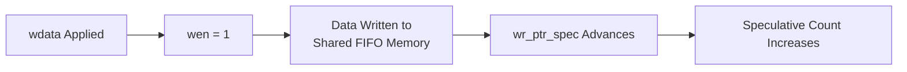

The data is physically stored in memory but is not yet visible to the read
interface.

Therefore:

```text
wr_ptr_actual remains unchanged
wr_ptr_spec advances
```

The expected status is:

```text
txn_pending = 1
speculative_count > 0
```

Since the data is not committed:

```text
empty may remain asserted
```

if no previously committed data exists.

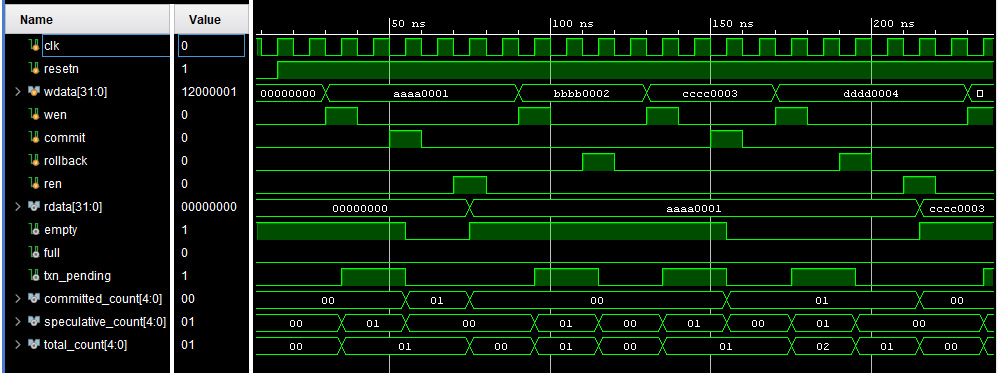

---

## 5. Commit Operation

The commit operation makes all currently staged data available to the
reader.

The operation is initiated by:

```text
commit = 1
rollback = 0
```

The pointer transition is:

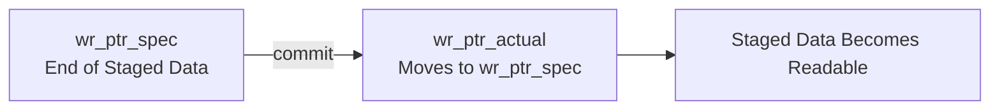

Before commit:
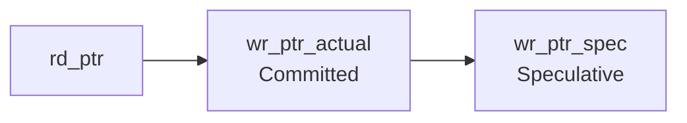
After commit:
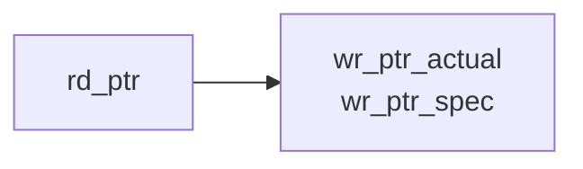
Both write pointers become equal.

The waveform should show:

```text
committed_count increases
speculative_count returns to 0
txn_pending returns to 0
```

The previously staged data becomes visible to the read interface.

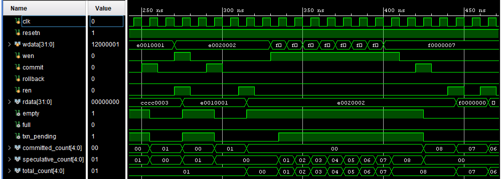

---

## 6. Rollback Operation

Rollback discards all speculative entries.

The operation is initiated by:

```text
rollback = 1
```

The speculative pointer is restored to the committed pointer:

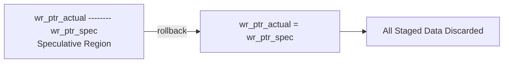

The memory contents do not need to be physically erased.

Instead, the staged region becomes logically invalid because the speculative
pointer returns to the committed boundary.

After rollback:

```text
speculative_count = 0
txn_pending = 0
```

Committed data remains unchanged.

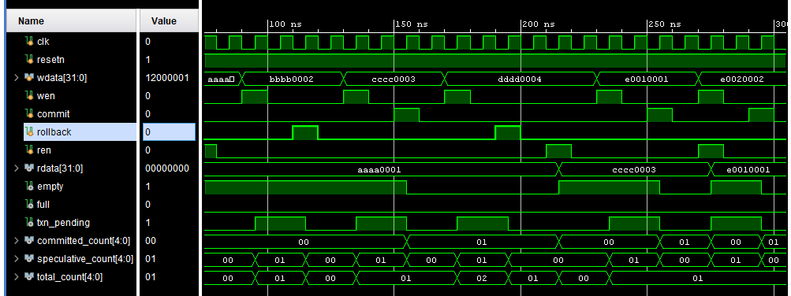

---

## 7. Read Operation

Only committed data can be read.

A read operation occurs when:

```text
ren = 1
empty = 0
```

The following sequence occurs:

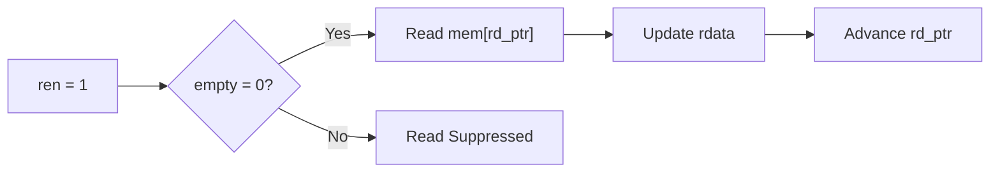

The FIFO implements registered synchronous read behavior.

The waveform confirms that:

```text
rdata receives the oldest committed FIFO entry
rd_ptr advances
committed_count decreases
```

The speculative region remains unaffected by the read operation.

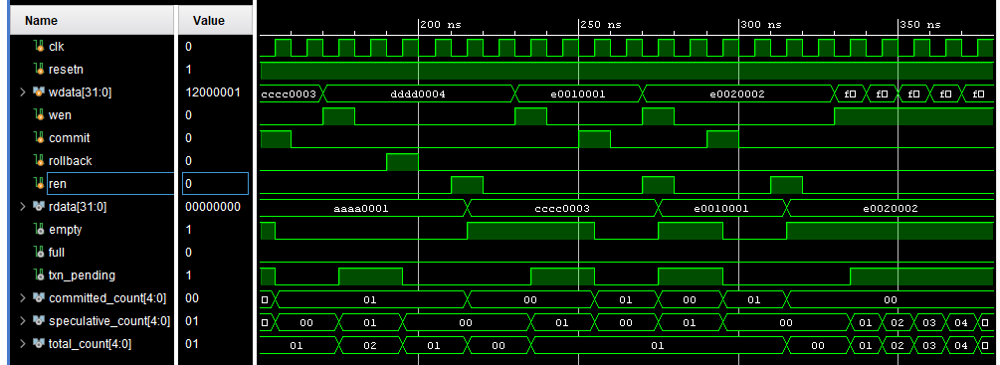

---

## 8. Write Followed by Commit and Read

A complete transaction sequence consists of:

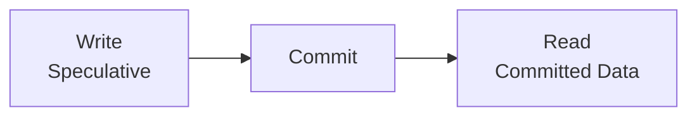

The expected sequence is:

### Step 1 — Write

```text
wen = 1
```

Result:

```text
speculative_count increases
txn_pending = 1
```

### Step 2 — Commit

```text
commit = 1
```

Result:

```text
committed_count increases
speculative_count = 0
txn_pending = 0
```

### Step 3 — Read

```text
ren = 1
```

Result:

```text
rdata outputs the committed value
committed_count decreases
```

The waveform confirms that speculative data cannot be read before commit.

> Insert write → commit → read waveform screenshot below.

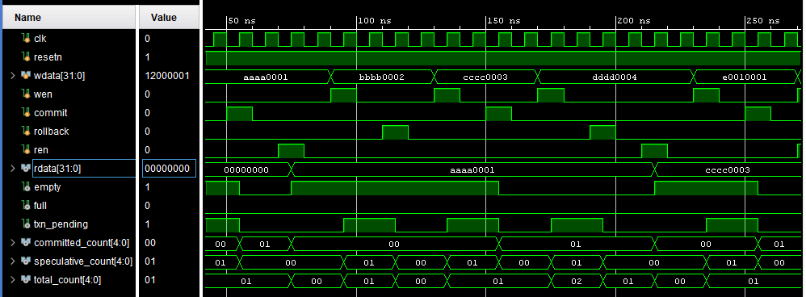

---

## 9. Write Followed by Rollback

This waveform demonstrates transaction cancellation.

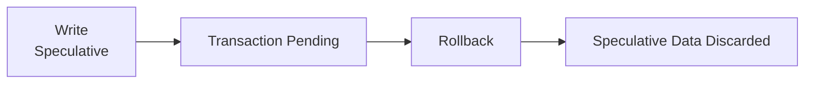

The expected behavior is:

### Before rollback

```text
speculative_count > 0
txn_pending = 1
```

### After rollback

```text
speculative_count = 0
txn_pending = 0
```

If there was no committed data before the transaction:

```text
empty = 1
```

The data written during the transaction is no longer accessible.


---

## 10. Simultaneous Read and Write

The FIFO supports simultaneous read and speculative write operations.

The waveform includes:

```text
ren = 1
wen = 1
```

During the same clock cycle:

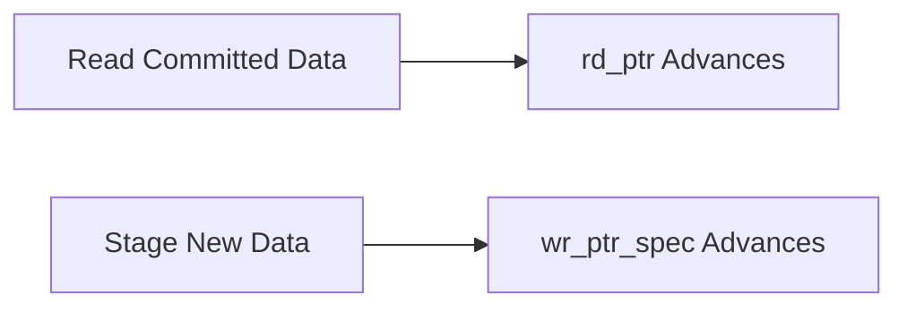

The read operation affects:

```text
rd_ptr
committed_count
```

The write operation affects:

```text
wr_ptr_spec
speculative_count
total_count
```

The waveform verifies that both operations can occur independently during
the same clock cycle.


---

## 11. Simultaneous Write and Commit

When `wen` and `commit` are asserted together, the commit uses the
pre-cycle value of `wr_ptr_spec`.

Therefore:

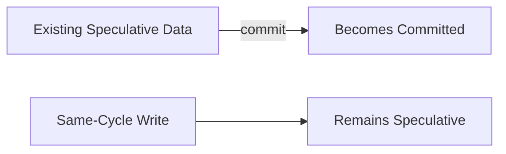

The newly written entry is not included in the same commit.

After the operation:

```text
wr_ptr_actual = previous wr_ptr_spec
wr_ptr_spec   = previous wr_ptr_spec + 1
```

Therefore:

```text
txn_pending = 1
```

The waveform verifies this transaction priority rule.


---

## 12. Simultaneous Write and Rollback

Rollback has priority over a simultaneous write.

The active signals are:

```text
wen = 1
rollback = 1
```

The resulting behavior is:

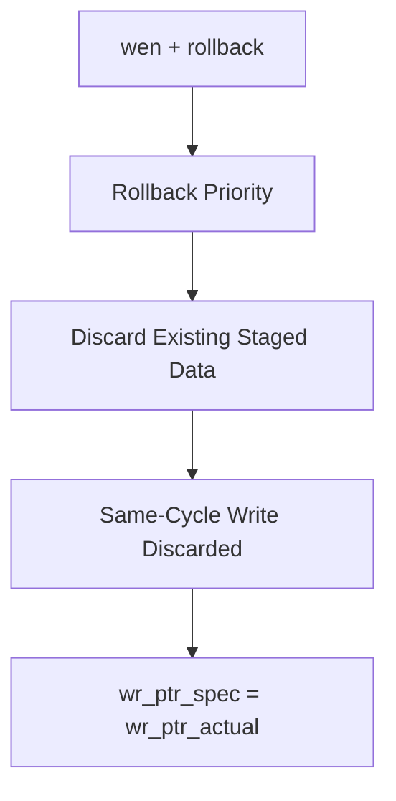

The waveform confirms that:

```text
speculative_count = 0
txn_pending = 0
```

after the clock edge.


---

## 13. Simultaneous Commit and Rollback

When both transaction control signals are asserted:

```text
commit = 1
rollback = 1
```

Rollback has priority.

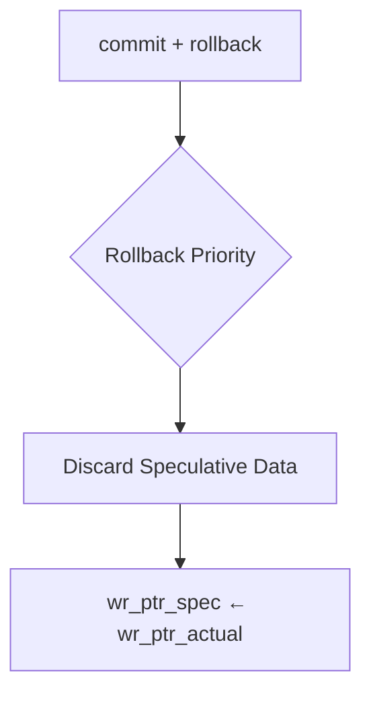

The commit operation is suppressed.

The waveform confirms:

```text
txn_pending = 0
speculative_count = 0
```

and no speculative data becomes committed.


---

## 14. Empty Boundary Condition

The FIFO is empty when:

```text
rd_ptr == wr_ptr_actual
```

Only committed data affects the empty flag.

This is important because speculative data may exist while:

```text
empty = 1
txn_pending = 1
```

Example:

```text
Committed Entries   = 0
Speculative Entries = 1

empty       = 1
txn_pending = 1
```

This confirms that uncommitted data is structurally invisible to the read
interface.


---

## 15. Full Boundary Condition

The FIFO is full when:

```text
wr_ptr_spec address == rd_ptr address
```

and the wrap bits are different.

The full condition includes both:

* Committed entries
* Speculative entries

Therefore, speculative data consumes FIFO storage even before it is
committed.

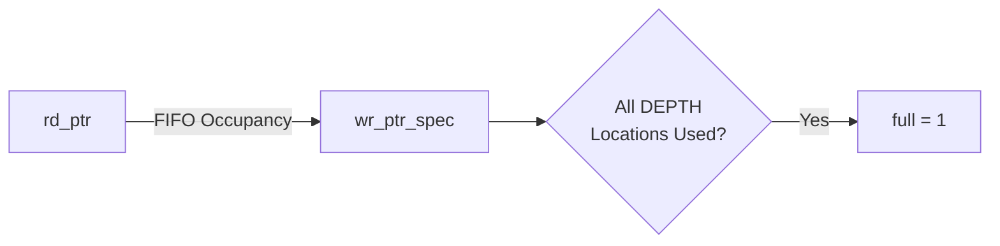

When:

```text
full = 1
```

a new speculative write is suppressed.


---

## 16. Read and Write at Full Boundary

One of the tested corner cases performs simultaneous operations when the
FIFO is full.

The test verifies:

```text
FIFO initially full
ren = 1
wen = 1
```

The waveform demonstrates how the implementation handles the full boundary
according to the current-cycle `full` status and the synchronous pointer
updates.

The verification test confirms the expected behavior with all assertions
passing.


---

## 17. Pointer Wraparound

The FIFO pointers contain an additional wrap bit.

For `DEPTH = 16`:

```text
Address bits = 4
Pointer bits = 5
```

The pointer transitions through:

```text
00000
00001
...
01111
10000
10001
...
```

The address portion wraps after the final memory location while the
additional pointer bit changes.

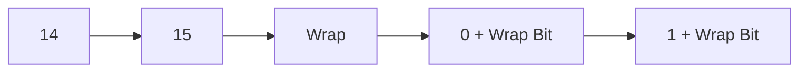

The waveform verifies correct operation across pointer wraparound.


---

## 18. Reset During Active Transaction

The verification environment also tests reset while speculative data is
present.

Before reset:

```text
committed_count   > 0
speculative_count > 0
total_count       > 0
```

After synchronous reset:

```text
rd_ptr            = 0
wr_ptr_actual     = 0
wr_ptr_spec       = 0

empty             = 1
full              = 0
txn_pending       = 0

committed_count   = 0
speculative_count = 0
total_count       = 0
```

The waveform confirms that reset clears both committed and speculative FIFO
state.


---

## 19. Long Simulation Waveform

The complete simulation waveform provides a consolidated view of all major
FIFO operations.

The captured waveform demonstrates transitions involving:

* Reset
* Speculative writes
* Commits
* Rollbacks
* Reads
* Simultaneous operations
* Empty and full conditions
* Occupancy count changes
* Pointer wraparound

The waveform should be divided into logical sections for easier analysis.


---

## 20. Verification Summary

The waveform analysis supports the results obtained from the automated
testbench.

The complete verification results were:

```text
Main Verification Tests

282 PASS / 0 FAIL / 282 TOTAL
STATUS: ALL TESTS PASSED
```

Functional coverage results:

```text
COVERAGE: 26 / 26 BINS HIT
FUNCTIONAL COVERAGE: 100.000000%
```

Parameterization test results:

```text
WIDTH = 8
DEPTH = 4

11 PASS / 0 FAIL / 11 TOTAL
STATUS: ALL PARAMETER TESTS PASSED
```

The waveform analysis visually confirms the behavior verified by the
automated assertions and functional coverage.

---

## 21. Conclusion

The simulation waveforms demonstrate the correct operation of the
Transactional Synchronous FIFO across normal and corner-case conditions.

The waveform analysis confirms:

* Speculative writes are stored but remain unreadable before commit.
* Commit makes staged data available to the reader.
* Rollback discards staged data.
* Rollback has priority during conflicting transaction controls.
* Simultaneous operations behave according to the documented priority rules.
* Empty depends only on committed data.
* Full accounts for committed and speculative occupancy.
* Pointer wraparound operates correctly.
* Reset clears all transactional FIFO state.

Together with the automated verification results, functional coverage, and
parameterization tests, the waveform analysis provides visual confirmation
of the Transactional FIFO behavior.

