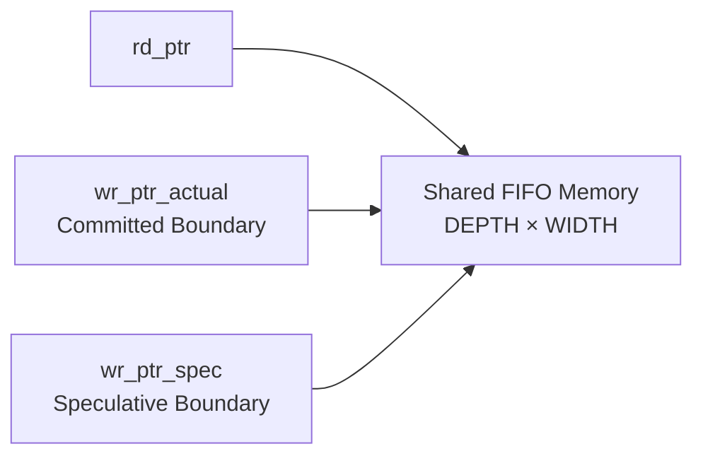
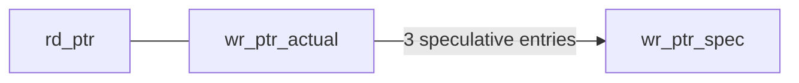
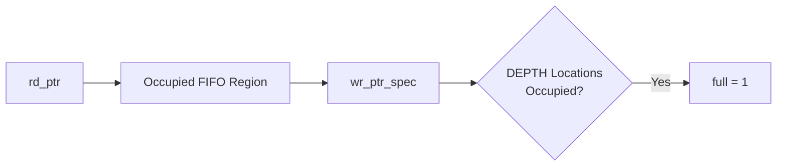
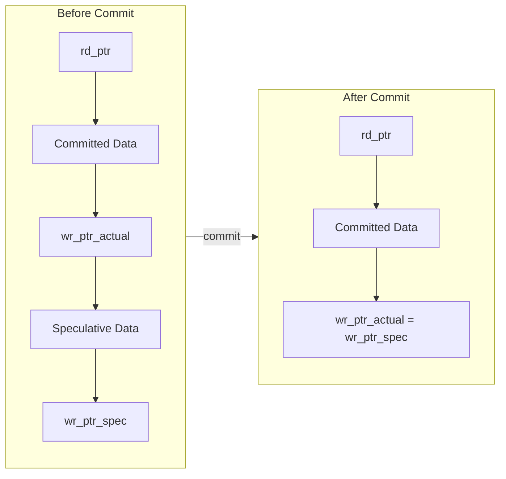
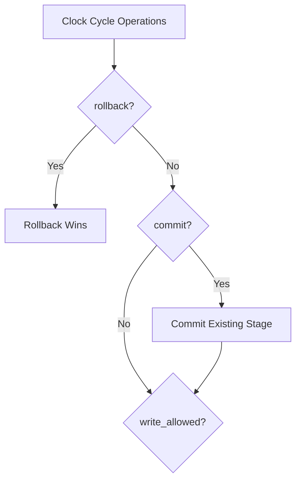
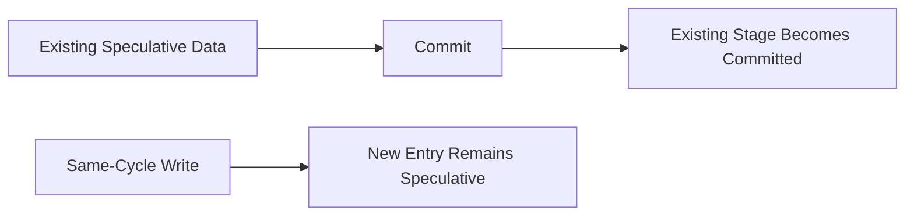
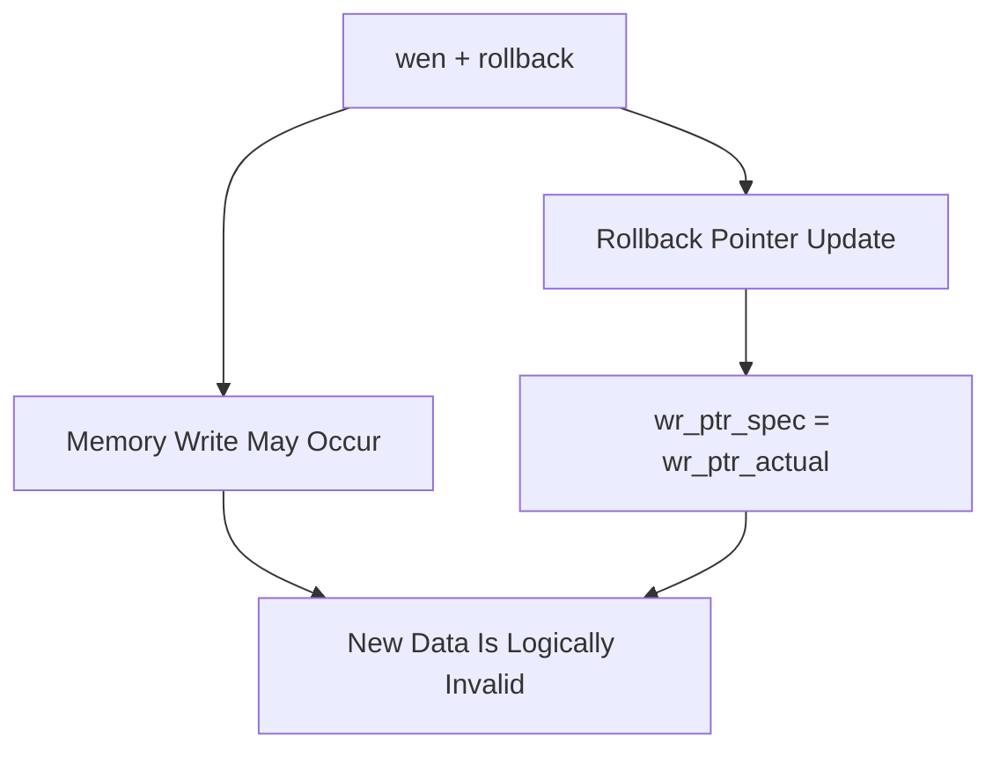
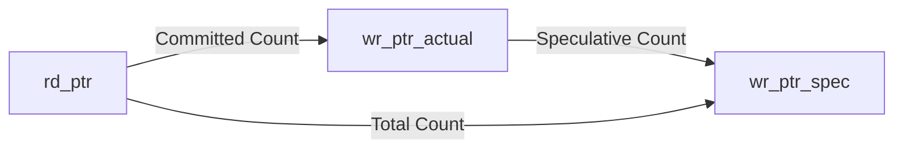
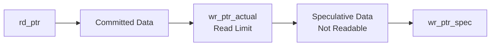
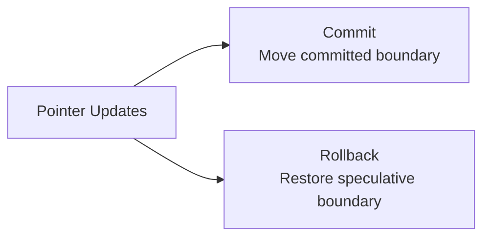

# Design Decisions

## 1. Overview

The Transactional Synchronous FIFO extends a conventional FIFO by adding
transactional behavior to write operations.

Instead of making every write immediately visible to the reader, newly
written data first enters a speculative state. The speculative data can
later be:

- **Committed** — making it available for reading.
- **Rolled back** — discarding it from the logical FIFO state.

This document explains the major architectural and RTL design decisions used
to implement this behavior.

---

## 2. Why a Three-Pointer Architecture Was Used

A conventional FIFO typically uses two pointers:

```mermaid
flowchart LR
    RD["rd_ptr<br/>Read Pointer"]
    WR["wr_ptr<br/>Write Pointer"]

    RD --> MEM["FIFO Memory"]
    WR --> MEM
````

A transactional FIFO requires an additional boundary between committed and
speculative data.

The final architecture therefore uses three pointers:

```mermaid
flowchart LR

    RD["rd_ptr<br/>Read Boundary"]
    ACT["wr_ptr_actual<br/>Committed Boundary"]
    SPEC["wr_ptr_spec<br/>Speculative Boundary"]

    RD -->|"Committed Data"| ACT
    ACT -->|"Speculative Data"| SPEC
```


### Pointer responsibilities

| Pointer         | Purpose                                                          |
| --------------- | ---------------------------------------------------------------- |
| `rd_ptr`        | Points to the next committed entry available for reading         |
| `wr_ptr_actual` | Marks the end of committed data                                  |
| `wr_ptr_spec`   | Marks the end of all written data, including speculative entries |

This separation allows the design to distinguish between:

```text
Physically stored data
        ↓
Committed data + Speculative data
        ↓
Logically readable data
        ↓
Committed data only
```

The three-pointer architecture is the core design decision that enables
commit and rollback without requiring separate FIFO memories.

---

## 3. Shared Memory Instead of Separate Committed and Speculative Buffers

The design uses one shared memory array:

```verilog
reg [WIDTH-1:0] mem [0:DEPTH-1];
```

Both committed and speculative entries occupy the same physical FIFO memory.



A separate speculative buffer was not required because pointer boundaries
can logically distinguish the two regions.

### Logical view

```text
┌────────────────────────────────────────────────────────────┐
│                     Shared FIFO Memory                     │
├───────────────┬──────────────────────┬─────────────────────┤
│ Already Read  │   Committed Data     │  Speculative Data   │
├───────────────┼──────────────────────┼─────────────────────┤
│               │                      │                     │
│    rd_ptr ───►│                      │◄── wr_ptr_actual    │
│               │                      │                     │
│               │                      │◄── wr_ptr_spec      │
└────────────────────────────────────────────────────────────┘
```

### Advantages

Using one memory array provides:

* Lower storage overhead
* No data copying during commit
* No memory clearing during rollback
* Simple transactional state transitions
* Natural FIFO ordering

Commit and rollback are implemented by changing pointer boundaries rather
than moving or deleting data.

---

## 4. Why `empty` Uses the Committed Write Pointer

The `empty` flag is defined as:

```verilog
assign empty = (rd_ptr == wr_ptr_actual);
```

This is one of the most important design decisions.

The reader must only see committed data.

Consider the following state:

```text
Committed Entries   = 0
Speculative Entries = 3
```

The pointer relationship is:



Since:

```text
rd_ptr == wr_ptr_actual
```

the FIFO remains:

```text
empty = 1
```

even though data physically exists in the memory.

This guarantees that speculative data cannot accidentally become visible to
the read interface.

### Design principle

```text
Physical presence of data
        ≠
Logical visibility of data
```

Only the committed pointer determines whether data is readable.

---

## 5. Why `full` Uses the Speculative Write Pointer

The `full` flag is defined using `wr_ptr_spec`:

```verilog
assign full =
    (wr_ptr_spec[ADDR_W-1:0] == rd_ptr[ADDR_W-1:0]) &&
    (wr_ptr_spec[ADDR_W] != rd_ptr[ADDR_W]);
```

The FIFO must account for both:

* Committed entries
* Speculative entries

because both consume physical memory.



If only `wr_ptr_actual` were used for full detection, speculative writes
would not contribute to occupancy.

This could allow new writes to overwrite speculative data that has not yet
been committed or rolled back.

Therefore:

```text
full
    =
Committed Occupancy
    +
Speculative Occupancy
```

The speculative write pointer correctly represents the physical end of used
FIFO storage.

---

## 6. Why an Extra Wrap Bit Is Used

Each pointer contains one additional bit:

```verilog
reg [ADDR_W:0] rd_ptr;
reg [ADDR_W:0] wr_ptr_actual;
reg [ADDR_W:0] wr_ptr_spec;
```

For:

```text
DEPTH = 16
```

the address width is:

```text
ADDR_W = $clog2(16) = 4
```

The pointer width becomes:

```text
ADDR_W + 1 = 5 bits
```

The lower bits select the memory address:

```text
Pointer = [Wrap Bit | Address Bits]
```

Example:

```text
00000 → Address 0
00001 → Address 1
...
01111 → Address 15
10000 → Address 0 after wraparound
```

Without the extra bit, these two situations would look identical:

```text
Empty FIFO
rd_ptr = 0000
wr_ptr = 0000
```

and:

```text
Full FIFO after wraparound
rd_ptr = 0000
wr_ptr = 0000
```

The additional wrap bit resolves this ambiguity.

### Empty

```text
Pointers completely equal
```

### Full

```text
Address bits equal
Wrap bits different
```

This allows the FIFO to distinguish full and empty states correctly.

---

## 7. Commit Is Implemented as a Pointer Movement

The commit operation is:

```verilog
if (!rollback && commit) begin
    wr_ptr_actual <= wr_ptr_spec;
end
```

Commit does not copy data.

Instead:



The speculative boundary becomes the committed boundary.

### Benefits

Commit requires:

* No memory copy
* No data movement
* No iteration through FIFO entries
* No dependence on transaction size

Regardless of whether one or many entries are staged, commit is performed
through a single pointer update.

---

## 8. Rollback Is Also Implemented as a Pointer Movement

Rollback is implemented as:

```verilog
if (rollback) begin
    wr_ptr_spec <= wr_ptr_actual;
end
```

Rollback discards speculative data logically.


The memory contents remain physically unchanged.

For example:

```text
Memory Before Rollback:

Address 0 : A1
Address 1 : A2
Address 2 : B1
Address 3 : B2

Committed Boundary → Address 2
Speculative Boundary → Address 4
```

After rollback:

```text
Committed Boundary → Address 2
Speculative Boundary → Address 2
```

The values `B1` and `B2` may still physically exist in memory, but they are
outside the valid FIFO region.

They will eventually be overwritten by future writes.

This approach avoids unnecessary memory erase logic.

---

## 9. Why Rollback Has the Highest Transaction Priority

The RTL gives rollback priority:

```verilog
if (rollback) begin
    wr_ptr_spec <= wr_ptr_actual;
end else if (write_allowed) begin
    wr_ptr_spec <= wr_ptr_spec + 1'b1;
end
```

Commit is also disabled when rollback is active:

```verilog
if (!rollback && commit) begin
    wr_ptr_actual <= wr_ptr_spec;
end
```

The resulting priority is:



Rollback represents cancellation of the current transaction.

Giving it priority guarantees that speculative data cannot accidentally
become committed during a cancellation cycle.

This applies to:

```text
commit + rollback
wen + rollback
wen + commit + rollback
```

In all of these cases:

```text
rollback wins
```

---

## 10. Why Same-Cycle Write and Commit Use the Previous Speculative Pointer

The commit logic is:

```verilog
if (!rollback && commit) begin
    wr_ptr_actual <= wr_ptr_spec;
end
```

The write logic independently advances:

```verilog
wr_ptr_spec <= wr_ptr_spec + 1'b1;
```

Because non-blocking assignments evaluate the right-hand side using the
pre-clock values, a simultaneous write and commit behaves as:



The newly written entry is not included in that commit.

Example:

### Before clock edge

```text
wr_ptr_actual = 5
wr_ptr_spec   = 7
```

Two speculative entries exist.

### `wen = 1` and `commit = 1`

After the clock edge:

```text
wr_ptr_actual = 7
wr_ptr_spec   = 8
```

Therefore:

```text
Entries before pointer 7 → committed
Entry at pointer 7       → still speculative
```

This creates a clear and deterministic transaction boundary.

---

## 11. Why Same-Cycle Write and Rollback Discard the New Write

When:

```text
wen = 1
rollback = 1
```

the design uses:

```text
rollback priority
```

The speculative pointer is restored:

```text
wr_ptr_spec ← wr_ptr_actual
```

Although the memory write may occur in the same clock cycle when
`write_allowed` is true, the speculative pointer does not advance.

Therefore the new data is outside the valid FIFO boundary.



This behavior is consistent with the transaction rule:

```text
Rollback cancels all speculative activity in the cycle.
```

The data may remain physically stored until overwritten, but it cannot be
read or committed as part of the rolled-back transaction.

---

## 12. Why Full Writes Are Suppressed

The write enable is qualified as:

```verilog
wire write_allowed = wen && !full;
```

This ensures that:

```text
full = 1
        ↓
write_allowed = 0
        ↓
No speculative pointer advancement
        ↓
No FIFO state corruption
```

The design therefore prevents:

* Pointer overflow
* Overwriting unread committed data
* Corruption of speculative data
* Occupancy count overflow

The full flag is based on the speculative pointer because all speculative
entries already occupy physical FIFO storage.

---

## 13. Occupancy Counts Are Derived from Pointer Differences

The FIFO exposes three occupancy counters:

```verilog
assign committed_count   = wr_ptr_actual - rd_ptr;
assign speculative_count = wr_ptr_spec - wr_ptr_actual;
assign total_count       = wr_ptr_spec - rd_ptr;
```

The relationships are:



Therefore:

```text
total_count
    =
committed_count
    +
speculative_count
```

Using pointer subtraction avoids maintaining separate counters that could
become inconsistent with pointer state.

The counts are derived directly from the architectural boundaries.

---

## 14. Why `ADDR_W` Is a `localparam`

The address width is defined as:

```verilog
localparam ADDR_W = $clog2(DEPTH);
```

This decision prevents accidental inconsistency between:

```text
DEPTH
```

and:

```text
Pointer Address Width
```

For example:

```text
DEPTH = 16
ADDR_W = 4
```

The memory and pointers therefore remain structurally consistent.

Using a normal overridable parameter for `ADDR_W` could allow an invalid
configuration such as:

```text
DEPTH = 16
ADDR_W = 5
```

or:

```text
DEPTH = 16
ADDR_W = 3
```

This could cause:

* Incorrect pointer sizing
* Address truncation
* Out-of-range memory indexing
* Silent simulation errors

Using:

```verilog
localparam ADDR_W = $clog2(DEPTH);
```

permanently ties the pointer address width to FIFO depth.

---

## 15. Why the FIFO Is Parameterized

The design uses:

```verilog
parameter WIDTH = 32,
parameter DEPTH = 16
```

This allows the same RTL architecture to support different FIFO sizes.

For example:

```text
WIDTH = 8
DEPTH = 4
```

or:

```text
WIDTH = 32
DEPTH = 16
```

The parameterization test verified the smaller configuration:

```text
WIDTH = 8
DEPTH = 4

11 PASS / 0 FAIL / 11 TOTAL
STATUS: ALL PARAMETER TESTS PASSED
```

Parameterization improves RTL reuse without requiring changes to the core
architecture.

---

## 16. Why the Read Interface Is Restricted to Committed Data

The read operation is controlled by:

```verilog
if (ren && !empty) begin
    rdata  <= mem[rd_addr];
    rd_ptr <= rd_ptr + 1'b1;
end
```

Since:

```text
empty = (rd_ptr == wr_ptr_actual)
```

the read pointer can never advance into the speculative region.

The logical boundary is:



This makes transaction isolation structural rather than dependent on
additional read-side control logic.

---

## 17. Simultaneous Operation Priority Rules

The RTL defines deterministic behavior for conflicting operations.

| Operations                      | Result                                                           |
| ------------------------------- | ---------------------------------------------------------------- |
| `commit + rollback`             | Rollback wins                                                    |
| `wen + commit`                  | Commit old speculative region; new write remains speculative     |
| `wen + rollback`                | Rollback wins; new write is discarded logically                  |
| `ren + wen`                     | Read and speculative write occur independently                   |
| `ren + commit`                  | Read existing committed data while speculative data is committed |
| `ren + rollback`                | Read committed data while speculative data is discarded          |
| `wen + commit + rollback`       | Rollback wins                                                    |
| `ren + wen + commit`            | Read, write, and commit follow their independent priority rules  |
| `ren + wen + rollback`          | Read occurs; rollback cancels speculative region                 |
| `ren + wen + commit + rollback` | Rollback wins for transaction control                            |

These rules were explicitly tested in the verification environment.

---

## 18. Key Architectural Trade-Off

The main advantage of this design is that transactional operations are
implemented primarily through pointer manipulation.



### Advantages

* No data copying
* No memory clearing
* Constant-size transaction control
* Natural FIFO ordering
* Shared memory
* Clear transaction boundaries
* Parameterized architecture

### Trade-offs

* Requires an additional write pointer
* Requires additional status logic
* Speculative data occupies FIFO capacity
* A transaction can consume the entire FIFO before being committed
* Rollback does not physically erase memory contents

The design prioritizes simple and deterministic transaction control over
maximum storage flexibility.

---

## 19. Design Decision Summary

The main design decisions can be summarized as:

| Decision                                       | Reason                                               |
| ---------------------------------------------- | ---------------------------------------------------- |
| Three pointers                                 | Separate read, committed, and speculative boundaries |
| Shared memory                                  | Avoid duplicate storage and data copying             |
| `empty` uses committed pointer                 | Prevent speculative data from being read             |
| `full` uses speculative pointer                | Account for all occupied memory                      |
| Extra wrap bit                                 | Distinguish full and empty states                    |
| Commit moves a pointer                         | Make transactions visible efficiently                |
| Rollback restores a pointer                    | Discard transactions without clearing memory         |
| Rollback priority                              | Ensure deterministic transaction cancellation        |
| Same-cycle commit uses old speculative pointer | Preserve a clear transaction boundary                |
| Pointer-derived counts                         | Avoid maintaining independent counters               |
| `ADDR_W` as `localparam`                       | Prevent inconsistent parameter overrides             |
| Parameterized WIDTH and DEPTH                  | Improve RTL reusability                              |

---

## 20. Conclusion

The Transactional FIFO architecture is based on separating **physical data
storage** from **logical data visibility**.

The central concept is:

```text
Write
  ↓
Physically stored
  ↓
Speculative
  ├── Commit ────► Readable
  │
  └── Rollback ──► Discarded
```

The three-pointer architecture makes this possible without requiring
separate speculative memory or data-copy operations.

Commit and rollback are implemented as pointer-boundary changes, making
transaction handling simple and efficient.

The design decisions described in this document provide deterministic
behavior for normal FIFO operations, transactional operations, simultaneous
events, boundary conditions, and parameterized configurations.
