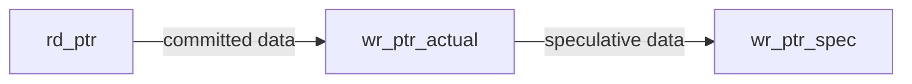
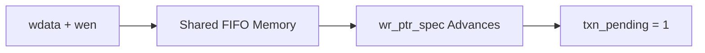
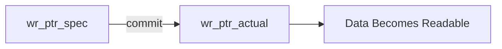
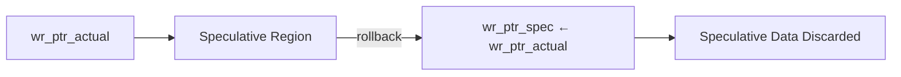
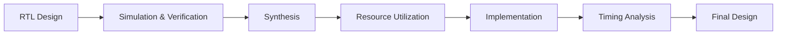
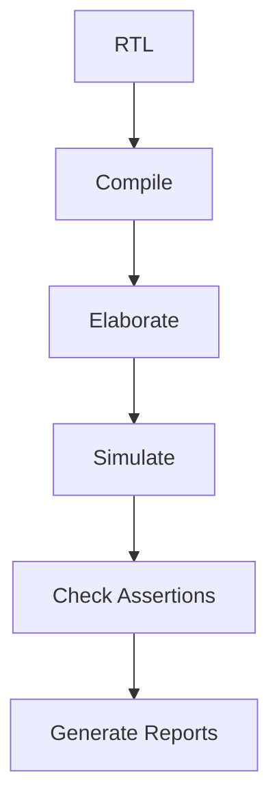
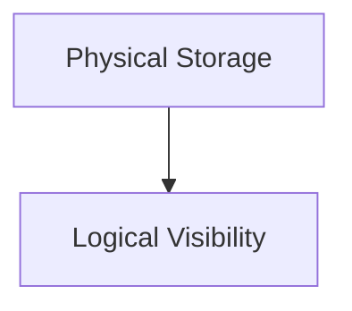
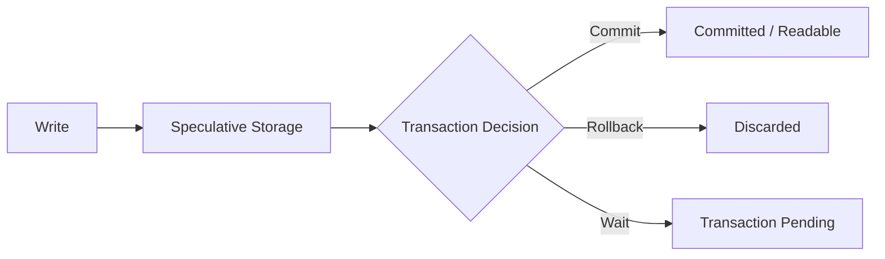

# Transactional FIFO

> A parameterized synchronous FIFO with speculative writes, transactional **commit**, and **rollback** support.


[](https://www.amd.com/en/products/software/adaptive-socs-and-fpgas/vivado.html)


---

## Overview

A conventional FIFO makes written data immediately available to the reader.

The **Transactional FIFO** extends this behavior by introducing a speculative write stage.

New data is first written into a **speculative region**. It remains invisible to the read interface until a `commit` operation is performed.

The speculative data can then either be:

- **Committed** — staged data becomes readable.
- **Rolled back** — staged data is discarded.
- **Kept pending** — staged data remains speculative until a later transaction operation.

```mermaid
flowchart LR

    W["Write"]
        --> S["Speculative Data"]

    S --> C{"Transaction Control"}

    C -->|"commit"| COM["Committed Data<br/>Readable"]

    C -->|"rollback"| RB["Discarded"]

    C -->|"no operation"| P["Transaction Pending"]
````

The design uses a shared memory array and a three-pointer architecture to implement transactional behavior without copying or physically clearing data.

---

## Features

* Parameterized data width and FIFO depth
* Synchronous single-clock FIFO
* Speculative write support
* Transaction commit operation
* Transaction rollback operation
* Shared FIFO memory
* Three-pointer architecture
* Committed and speculative occupancy tracking
* Empty detection based only on committed data
* Full detection based on total physical occupancy
* Pointer wraparound support
* Simultaneous read/write support
* Deterministic commit/rollback priority
* Active-low synchronous reset
* Functional coverage
* Parameterization testing
* FPGA synthesis and implementation support

## Configuration
| Parameter     |                Value |
| ------------- | -------------------: |
| Data Width    |              32 bits |
| FIFO Depth    |                   16 |
| Address Width |               4 bits |
| Architecture  |          Synchronous |
| Memory        | Single shared memory |


---

## Architecture

The FIFO uses three pointers to separate committed and speculative data.

```mermaid
flowchart LR

    subgraph FIFO["Transactional FIFO"]

        RD["rd_ptr<br/>Read Boundary"]

        ACT["wr_ptr_actual<br/>Committed Boundary"]

        SPEC["wr_ptr_spec<br/>Speculative Boundary"]

        MEM["Shared FIFO Memory<br/>DEPTH × WIDTH"]

    end

    RD --> MEM
    ACT --> MEM
    SPEC --> MEM

    RD -.->|"Committed Region"| ACT
    ACT -.->|"Speculative Region"| SPEC
```

The logical FIFO layout is:



### Pointer Functions

| Pointer         | Function                                      |
| --------------- | --------------------------------------------- |
| `rd_ptr`        | Points to the next committed entry to read    |
| `wr_ptr_actual` | Marks the boundary of committed data          |
| `wr_ptr_spec`   | Marks the end of committed + speculative data |

---

# Transaction Operation

## Write

A write stores data in the speculative region.



The data is physically stored but cannot be read until committed.

---

## Commit

A commit makes all currently staged data visible.



Conceptually:

```text
wr_ptr_actual ← wr_ptr_spec
```

No data is copied.

---

## Rollback

Rollback discards all speculative data.



The memory contents are not physically erased. The speculative region simply becomes logically invalid.

---

# Status Signals

| Signal              | Description                                           |
| ------------------- | ----------------------------------------------------- |
| `empty`             | No committed data is available                        |
| `full`              | Committed + speculative data occupies the entire FIFO |
| `txn_pending`       | Speculative data is waiting for commit or rollback    |
| `committed_count`   | Number of committed entries                           |
| `speculative_count` | Number of staged entries                              |
| `total_count`       | Total FIFO occupancy                                  |

The relationships are:

```text
total_count = committed_count + speculative_count
```

---

# Operation Priority

The design defines deterministic behavior for simultaneous operations.

| Operations                      | Behavior                                                              |
| ------------------------------- | --------------------------------------------------------------------- |
| `commit + rollback`             | Rollback wins                                                         |
| `wen + commit`                  | Existing speculative data is committed; new write remains speculative |
| `wen + rollback`                | Rollback wins; same-cycle write is logically discarded                |
| `ren + wen`                     | Read and speculative write operate simultaneously                     |
| `ren + commit`                  | Read committed data while speculative data becomes committed          |
| `ren + rollback`                | Read committed data while speculative data is discarded               |
| `wen + commit + rollback`       | Rollback wins                                                         |
| `ren + wen + commit`            | All operations follow defined pointer behavior                        |
| `ren + wen + rollback`          | Read occurs; speculative transaction is rolled back                   |
| `ren + wen + commit + rollback` | Rollback wins                                                         |

---

# Verification Results

The design was verified using a self-checking Verilog testbench.

## Main Verification

```text
=====================================================
 RESULTS: 282 PASS / 0 FAIL / 282 TOTAL
 STATUS : ALL TESTS PASSED
=====================================================
```

### Tested Scenarios

* Reset behavior
* Basic write operations
* Basic read operations
* Commit operations
* Rollback operations
* Multiple speculative writes
* Multiple commits
* Back-to-back commits
* Rollback with no pending transaction
* Commit with no pending transaction
* FIFO empty condition
* FIFO full condition
* Near-full condition
* Pointer wraparound
* Simultaneous read + write
* Simultaneous write + commit
* Simultaneous write + rollback
* Simultaneous read + commit
* Simultaneous read + rollback
* Simultaneous commit + rollback
* Complex simultaneous operations
* Full-boundary operations
* Reset during active transaction

---

# Functional Coverage

Manual functional coverage was added to ensure all important operation classes and corner cases were exercised.

```text
=====================================================
 FUNCTIONAL COVERAGE REPORT
=====================================================

 COVERAGE: 26 / 26 BINS HIT
 FUNCTIONAL COVERAGE: 100.000000%
=====================================================
```

Coverage includes:

* Transaction states
* Write operations
* Read operations
* Simultaneous operations
* Complex transaction conflicts
* Empty conditions
* Near-full conditions
* Full conditions
* Read/write boundary conditions
* Reset conditions
* Commit without transaction
* Rollback without transaction
* Pointer wraparound

---

# Parameterization Test

The FIFO was also verified using a different configuration.

```text
WIDTH = 8
DEPTH = 4
```

Result:

```text
=====================================================
 RESULTS: 11 PASS / 0 FAIL / 11 TOTAL
 STATUS : ALL PARAMETER TESTS PASSED
=====================================================
```

This confirms that the RTL architecture works correctly across different FIFO parameter configurations.

---

# Implementation Flow

The RTL design follows the standard FPGA implementation flow.



The design supports FPGA synthesis and implementation using Xilinx Vivado.

---

# Repository Structure

```text
Transactional_FIFO/
│
├── rtl/
│   └── transactional_fifo.v
│
├── tb/
│   ├── tb_transactional_fifo.v
│   └── tb_parameterized_fifo.v
│
├── docs/
│   ├── 01_architecture.md
│   ├── 02_fifo_operation.md
│   ├── 03_transaction_operations.md
│   ├── 04_test_plan.md
│   ├── 05_verification_results.md
│   ├── 06_synthesis_implementation.md
│   ├── 07_waveform_analysis.md
│   └── 08_design_decisions.md
│
├── images/
│   ├── waveform_reset.png
│   ├── waveform_speculative_write.png
│   ├── waveform_commit.png
│   ├── waveform_rollback.png
│   ├── waveform_read.png
│   ├── waveform_write_commit_read.png
│   ├── waveform_full.png
│   ├── waveform_wraparound.png
│   ├── synthesis_schematic.png
│   └── implementation_schematic.png
│
├── reports/
│   ├── verification_report.txt
│   ├── functional_coverage.txt
│   ├── parameterization_report.txt
│   ├── utilization_report.txt
│   ├── timing_summary.txt
│   ├── synthesis_report.txt
│   └── implementation_report.txt
│
└── README.md
```

---

# Documentation

Detailed documentation is available in the [`docs`](docs/) directory.

| Document                                                                 | Description                                               |
| ------------------------------------------------------------------------ | --------------------------------------------------------- |
| [01 - Overview](docs/01_project_overview.md)                             | Overview of the design        |
| [02 - Architecture](docs/02_architecture.md)                         | Basic Overall FIFO architecture and three-pointer design              |
| [03 - Transaction Operations](docs/03_transactional_operations.md)         | Write, commit, rollback, and simultaneous operations      |
| [04 - Test Plan](docs/04_design_and_rtl.md)                                   | Verification strategy and test scenarios                  |
| [05 - Verification Results](docs/05_verification_results.md)             | Test results and functional coverage                      |
| [06 - Synthesis and Implementation](docs/06_synthesis_implementation.md) | Vivado synthesis, implementation, utilization, and timing |
| [07 - Waveform Analysis](docs/07_waveform_analysis.md)                   | Detailed simulation waveform analysis                     |
| [08 - Design Decisions](docs/08_design_decisions.md)                     | Architectural and RTL design choices                      |

---

# Quick Start

## Clone the Repository

```bash
git clone 
cd Transactional_FIFO
```

## Add the RTL Source

Add:

```text
rtl/transactional_fifo.v
```

## Add the Testbench

Add:

```text
tb/tb_transactional_fifo.v
```

## Run Simulation

Compile the RTL and testbench using your preferred Verilog simulator.

Example simulation flow:



Expected result:

```text
282 PASS / 0 FAIL / 282 TOTAL
STATUS : ALL TESTS PASSED
```

---

# Key Design Concept

The central idea behind the Transactional FIFO is the separation between:



A write does not immediately make data readable.

Instead:



This allows the FIFO to support transactional data handling without requiring separate speculative memory.

---

# Results Summary

| Category                       | Result             |
| ------------------------------ | ------------------ |
| Main Verification              | **282 / 282 PASS** |
| Functional Coverage            | **26 / 26 Bins**   |
| Functional Coverage Percentage | **100%**           |
| Parameterization Test          | **11 / 11 PASS**   |
| RTL Parameterized              | **Yes**            |
| Commit Support                 | **Yes**            |
| Rollback Support               | **Yes**            |
| Simultaneous Operations        | **Verified**       |
| Pointer Wraparound             | **Verified**       |
| Reset During Transaction       | **Verified**       |

---

# Future Improvements

Potential extensions include:

* Asynchronous dual-clock FIFO support
* Formal verification
* SystemVerilog assertions
* UVM-based verification environment
* Hardware validation on an FPGA board
* Configurable transaction boundaries
* Multiple independent transactions
* Nested transactions
* Performance and timing optimization
* Additional parameter combinations
* Hardware resource optimization

---

# License

This project is intended for educational and research purposes.

---

## Author

**Dhrumil Moga**

M.Tech Student | VLSI / Digital Design / FPGA / Verification

---

⭐ If you find this project useful, consider starring the repository.
